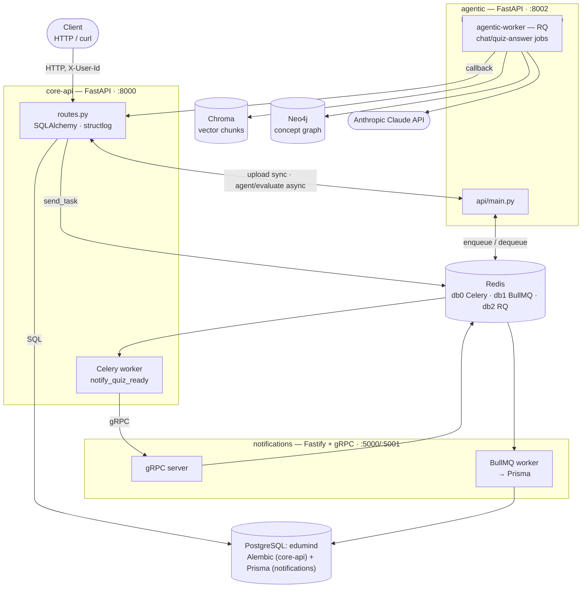

# Backend in python — refresher — EduMind

A project to refresh hands-on familiarity with backend infrastructure in python (plus a couple of intentional excursions into Node/TypeScript): async APIs, ORM + migrations, background jobs, RAG, multi-service orchestration, and observability, built around a study-assistant domain (EduMind: upload a document, chat with it — ask questions, get a summary, or a quiz — and get quiz answers auto-graded). Each technology is wired in just enough to work; none are used in depth.


## Architecture Overview

Four services, three Redis-backed queues, two LLM-adjacent stores (Chroma + Neo4j), one shared Postgres. See `docs/architecture.md` for the full component diagram, an ER diagram, and hand-traced sequence diagrams for the upload, chat (ask/quiz/summarize), and quiz-answer-evaluation flows.



## Tech Stack

- **FastAPI** — REST API framework (`core-api`, `agentic`)
- **PostgreSQL** — shared primary database (`edumind`), one schema managed by Alembic, one by Prisma
- **SQLAlchemy + Alembic** — ORM and migrations for `core-api`
- **Redis** — backs three independent queues on separate logical DBs: Celery (`core-api`), BullMQ (`notifications`), RQ (`agentic`)
- **Celery** — dispatches quiz/chat-answer-ready notifications from `core-api`
- **RQ** — `agentic`'s own job queue; runs chat-answer and quiz-evaluation jobs off the request path
- **LangGraph** — the RAG orchestration graph (intent classification → retrieval → answer/quiz/summarize/evaluate), with SQLite-backed thread checkpointing so a quiz can pause and later resume for grading
- **Anthropic Claude API** — intent classification, entity extraction, answer/quiz/summary generation, and quiz-answer grading
- **ChromaDB** — vector store for document chunks, scoped by `document_id`
- **sentence-transformers** — local embeddings (`all-MiniLM-L6-v2`), no API call needed for retrieval
- **Neo4j** — a global knowledge graph of concepts/relationships extracted from ingested documents
- **Node.js + TypeScript + Fastify** — the `notifications` service
- **Prisma** — ORM/migrations for `notifications`' slice of the shared `edumind` database
- **BullMQ + gRPC** — `notifications`' own queue, fed by a gRPC call from `core-api`'s Celery worker
- **structlog** — structured JSON logging (`core-api`)
- **Prometheus** — metrics scraping
- **Grafana** — metrics visualisation
- **Docker** — containerised infrastructure for all of the above

## Services

- **core-api** (port 8000) — study-assistant domain: users, documents, quizzes, quiz attempts, chats/messages. Owns the shared identity model — a plain `X-User-Id` header, validated against the `users` table, with every ownership check returning 404 rather than 403. Talks to `agentic` over HTTP and to `notifications` over gRPC (via its Celery worker).
- **worker** — the Celery worker process for `core-api`; currently runs one task, `notify_quiz_ready`.
- **agentic** (host port 8002) — RAG service: PDF ingestion (Chroma + Neo4j) and a LangGraph agent that answers questions, generates quizzes, summarizes, and grades quiz answers against the Anthropic Claude API. `/upload` is synchronous; `/agent` and `/evaluate` are enqueue-and-ack, processed by `agentic-worker`.
- **agentic-worker** — `agentic`'s RQ worker; runs the actual LangGraph invocations and calls back into `core-api`'s `/internal/chat-answers` when done.
- **notifications** (ports 5000/5001) — Fastify HTTP API + gRPC server for delivering "your quiz/answer is ready" notifications, backed by its own BullMQ worker and Prisma-managed `notifications` table.

## Running Locally

### Prerequisites
- Docker + Docker Compose
- make
- An Anthropic API key in `services/agentic/.env` (`ANTHROPIC_API_KEY=...`) — required by `docker-compose.yml`'s `env_file:` for the `agentic`/`agentic-worker` services; nothing starts meaningfully in the RAG/chat path without it

### Start everything

```bash
make up
```

Brings up `core-api`, `worker` (Celery), `agentic`, `agentic-worker` (RQ), `notifications`, `postgres`, `redis`, `neo4j`, `prometheus`, and `grafana`.

### Run migrations

```bash
cd services/core-api
alembic upgrade head
```

`notifications`' own tables are managed separately via Prisma (`cd services/notifications && npx prisma migrate deploy`) — one `alembic upgrade head` does not cover them, even though both services share the `edumind` database.

### Run tests

```bash
cd services/core-api
pytest tests/ -v
```

Requires a running Postgres (`make up`, at minimum) — tests hit the real `edumind` database, no mocks. `notifications` has its own suite (`cd services/notifications && npm test`).

## API Endpoints

`core-api` is the only service with a client-facing API — `agentic` (`/upload`, `/agent`, `/evaluate`) and `notifications` (`/notifications`, gRPC `NotifyQuizReady`) are internal, called by `core-api` rather than directly by clients.

| Method | Endpoint | Description |
|--------|----------|-------------|
| POST | `/documents` | Create a document — multipart, atomic: `title` + `file` together, ingested synchronously into Chroma + Neo4j via `agentic`, document status becomes `ready`/`failed`. There is no way to create a document without a file. |
| GET | `/documents` | List the caller's documents |
| GET | `/documents/{id}` | Get a document (404 if not the caller's) |
| PATCH | `/documents/{id}` | Update a document (404 if not the caller's) |
| DELETE | `/documents/{id}` | Delete a document (404 if not the caller's) |
| GET | `/quizzes` | List quizzes on the caller's documents |
| GET | `/quizzes/{id}` | Get a quiz (404 if its document isn't the caller's) |
| PATCH | `/quizzes/{id}` | Update a quiz (404 if its document isn't the caller's) |
| DELETE | `/quizzes/{id}` | Delete a quiz (404 if its document isn't the caller's) |
| POST | `/quiz_attempts` | Record an attempt (score is client-supplied) against one of the caller's quizzes |
| GET | `/quizzes/{id}/stats` | Aggregate stats (`avg_score`, `attempt_count`) for a quiz (404 if not the caller's) |
| POST | `/chats` | Start a chat against one of the caller's `ready` documents — idempotent per `document_id`: returns the existing chat (200) if one already exists instead of creating another. Each document has at most one chat (`chats.document_id` is unique). |
| GET | `/chats` | List the caller's chats |
| GET | `/chats/{id}` | Get a chat (404 if not the caller's) |
| GET | `/chats/{id}/messages` | List a chat's messages in order |
| POST | `/chats/{id}/messages` | Ask a question, request a quiz/summary, or (with `intent: "quiz_answer"`) submit a quiz answer for grading — `202`, dispatched to `agentic` asynchronously; the reply shows up via `GET .../messages` once the LangGraph job (and, for quiz answers, LLM grading) finishes |
| GET | `/health` | Health check |

There is no `POST /quizzes` — quizzes are only created as a side effect of a chat message classified with `intent == "quiz"`; there's likewise no polling/job-status endpoint for an in-flight chat message, by design (see `docs/architecture.md`'s message-flow diagram).

All ownership checks return 404, never 403, so cross-user probing can't distinguish "doesn't exist" from "not yours."

## Observability

Prometheus and Grafana are included in the Docker setup.

| Service | URL |
|---------|-----|
| Prometheus | http://localhost:9090 |
| Grafana | http://localhost:3000 |

`core-api` exposes a `/metrics` endpoint scraped by Prometheus every 15s. Open Grafana at http://localhost:3000, add Prometheus as a datasource (http://prometheus:9090), and query metrics like http_requests_total for request counts and histogram_quantile(0.90, rate(http_request_duration_seconds_bucket[5m])) for p90 latency.


## Build Phases

### Phase 1 — FastAPI + PostgreSQL
- Set up the service with FastAPI and an async PostgreSQL connection via `asyncpg`.

### Phase 2 — Alembic Migrations
- Introduced Alembic for schema versioning. Migration scripts handle table creation and column changes, keeping the database schema in sync across environments without manual SQL.

### Phase 3 — Idempotency (superseded)
- The original lending domain added idempotency-key support on application creation. No longer applicable — removed along with the lending domain in Phase 6.

### Phase 4 — Celery + Redis
- Wired up Redis as a task broker and Celery as a worker, originally for an async credit-check job. Kept wired through the domain rewrite (Phase 6) for a future async job; no task is currently registered.

### Phase 5 — Kafka (removed)
- Kafka (KRaft mode) previously carried an event between two lending services. Removed entirely — see git history if you need it.

### Phase 6 — EduMind domain rewrite
- Replaced the lending domain (`LoanApplication`, a second `ledger` service for double-entry bookkeeping) with EduMind's study-assistant domain: `users`, `documents`, `quizzes`, `quiz_attempts`, all ownership-scoped via `X-User-Id`.
- Consolidated to a single service, `core-api`, and renamed the shared database to `edumind`.

### Phase 7 — Docker
- Containerised the service with its own Dockerfile.
- `docker-compose.yml` orchestrates core-api, the Celery worker, PostgreSQL, and Redis with healthchecks and dependency ordering. A `Makefile` wraps common commands (`make up`, `make down`, `make logs`).

### Phase 8 — Observability
- Added `prometheus-fastapi-instrumentator` to expose a `/metrics` endpoint.
- Prometheus scrapes metrics every 15s.
- Grafana visualises request rate, p90 latency, and error rates per endpoint — giving production-style visibility into the running system.

### Phase 9 — Notifications service (Node/gRPC)
- Added `notifications`, a standalone Fastify + TypeScript service with its own Prisma-managed slice of the shared `edumind` database and a BullMQ queue (Redis, its own logical DB) decoupling the gRPC handler from the DB write.
- `core-api` gained a gRPC client and a Celery task (`notify_quiz_ready`) so quiz creation dispatches a "quiz ready" notification asynchronously, with retry, instead of calling gRPC inline.

### Phase 10 — Agentic service consolidation (RAG)
- Pulled a standalone RAG-assistant project into the monorepo as `services/agentic`: PDF ingestion → chunking → local `sentence-transformers` embeddings → Chroma vector store, entity/relationship extraction into Neo4j, and a LangGraph graph fronted by the Anthropic Claude API.
- `POST /documents/{id}/upload` was added to `core-api`, forwarding synchronously into agentic's `/upload` — a deliberate, revisit-if-it-becomes-a-problem choice (see `CLAUDE.md`'s Decisions).

### Phase 11 — Chat (Q&A over a document)
- Added `chats`/`messages` tables and `POST /chats/{chat_id}/messages`, originally synchronous: it called agentic's `/agent` inline and stored the LangGraph result (answer, quiz questions, or summary) as the assistant reply in one request.

### Phase 12 — Async chat pipeline (RQ) + quiz-answer evaluation
- Made chat answering fully async: `agentic` gained its own job queue (RQ, a third logical Redis DB) and worker process (`agentic-worker`); `/agent` became enqueue-and-ack (202), and the RQ job calls core-api back on a new `POST /internal/chat-answers` once the LLM work finishes. `POST /chats/{chat_id}/messages` itself became 202 fire-and-forget — direct-from-client quiz creation (`POST /quizzes`, `POST /quizzes/generate`) was removed, since quizzes now only originate from chat intent detection.
- Extended the same LangGraph thread for grading: a quiz-generating chat message pauses its graph after the `quiz` node and persists `thread_id` on the `Quiz` row; answering it (`intent: "quiz_answer"`) resumes that exact thread through a new `evaluate` node, LLM-scored, and writes a `QuizAttempt` back through the same callback and notify chain.

### Phase 13 — Document↔chat 1:1, atomic upload, auto-start chat
- Collapsed `POST /documents` + `POST /documents/{id}/upload` into one atomic multipart endpoint — a document can no longer be created without a file, closing the loophole opened back in Phase 10.
- Added a unique index on `chats.document_id` (each document has at most one chat) and made `POST /chats` idempotent per `document_id` (returns the existing chat instead of erroring on a repeat call).
- The frontend (`remote-documents`) now auto-creates/reuses the document's chat right after a successful upload and navigates straight into it — no manual "start chat" step. Cross-remote navigation into a route owned by a different federated app (`remote-chat`'s `/chat/:chatId`) works because `react-router-dom` is a shared singleton across all 5 apps; see `frontend/CONTRACTS.md`.

### Phase 14 — Merge remote-documents into remote-chat (chat-first UX)
- Retired `remote-documents` as a standalone federated app — 3 domain/utility remotes now (`design-system`, `chat`, `notifications`), not 4. `ChatList` (`remote-chat`'s `/chat` index route) is the sole landing page; a "New chat" link leads to `/chat/new`, which now owns the upload→auto-start-chat flow moved verbatim from the old `DocumentUpload.tsx`.
- No backend changes — `POST /documents` (atomic multipart) and idempotent-per-`document_id` `POST /chats` from Phase 13 were already exactly what this flow needed.
