# AI Study Assistant - Edumind

Upload a PDF, chat with it — Q&A, summaries, quiz generation & auto-grading — powered by multi-agent RAG (LangGraph, MCP, evals) with a knowledge graph, an event-driven distributed backend for async LLM workloads, and a micro-frontend UI (Webpack Module Federation).


## High-Level Design

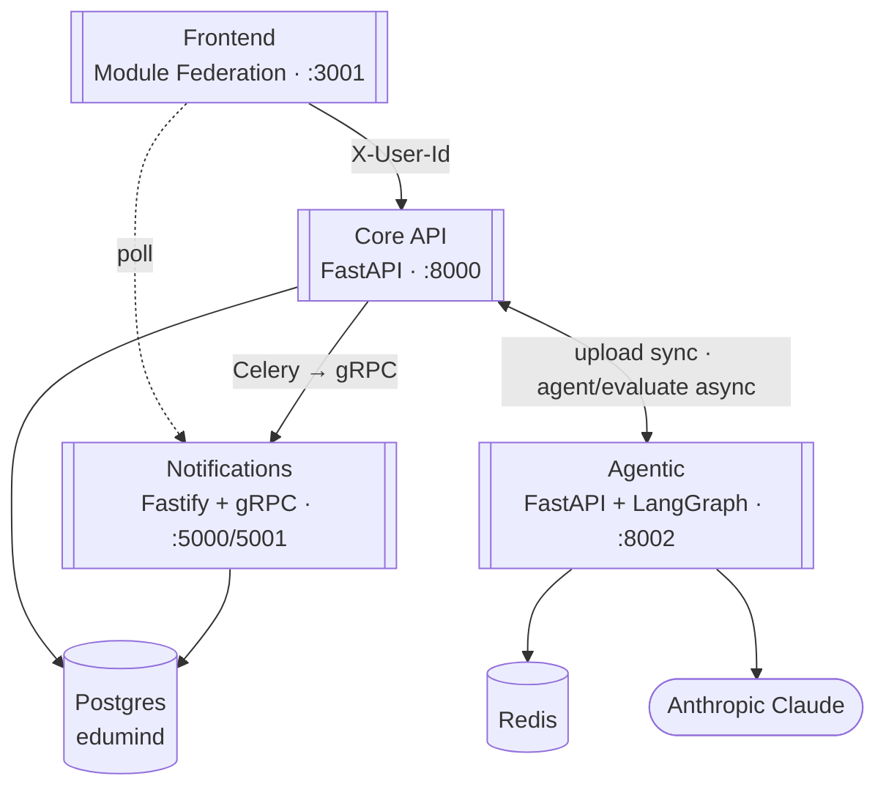

Everything else — Neo4j, Chroma, Prometheus/Grafana, the MCP server — lives inside `Agentic`/`Core API`; see the per-service diagrams below.

## Services

### Frontend

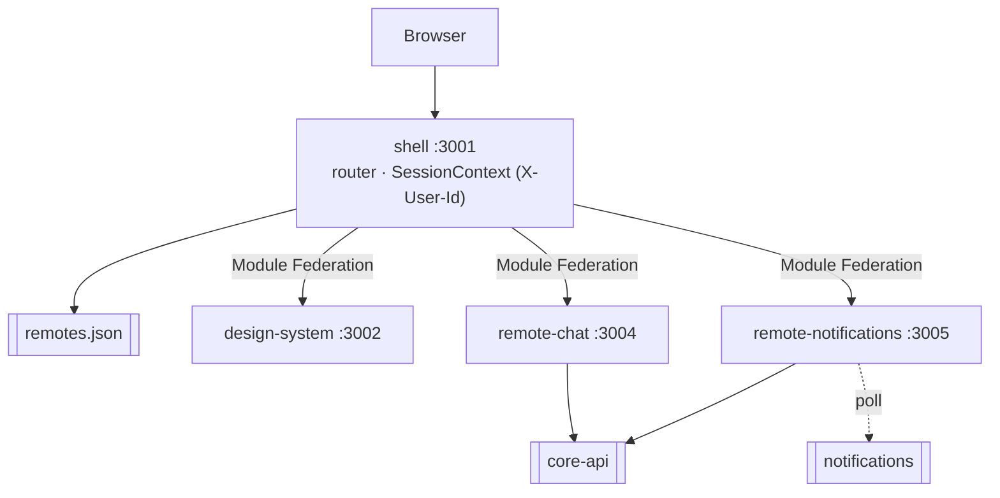

### Core API

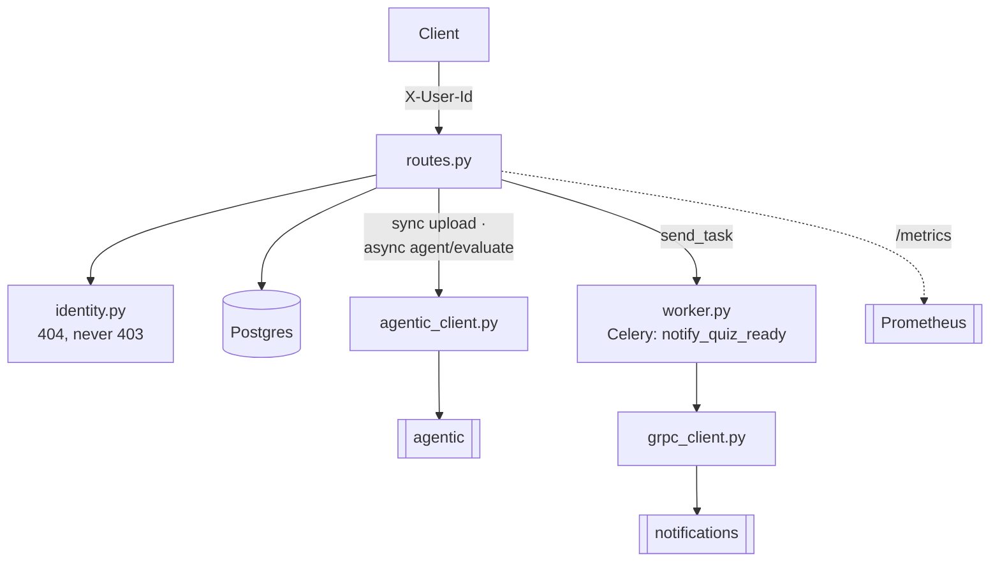

### Notifications

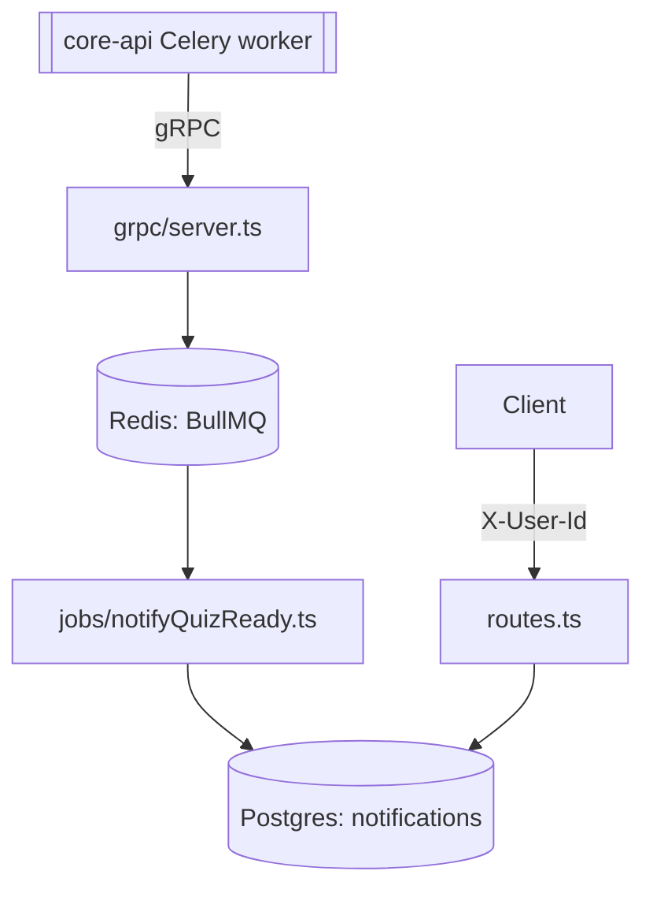

### Agentic

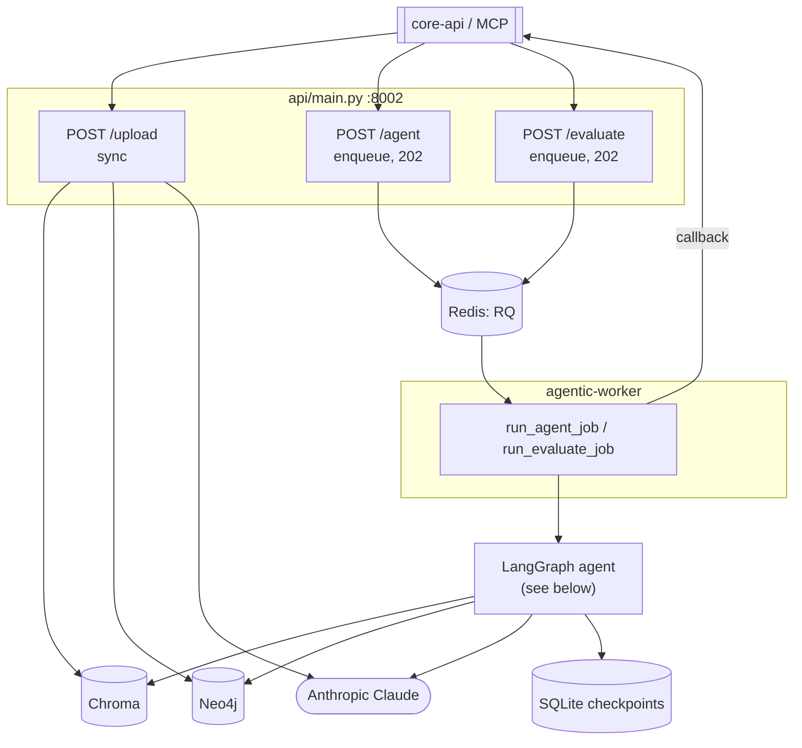
**Agent Graph — LangGraph state machine** (`agents/agents.py`):

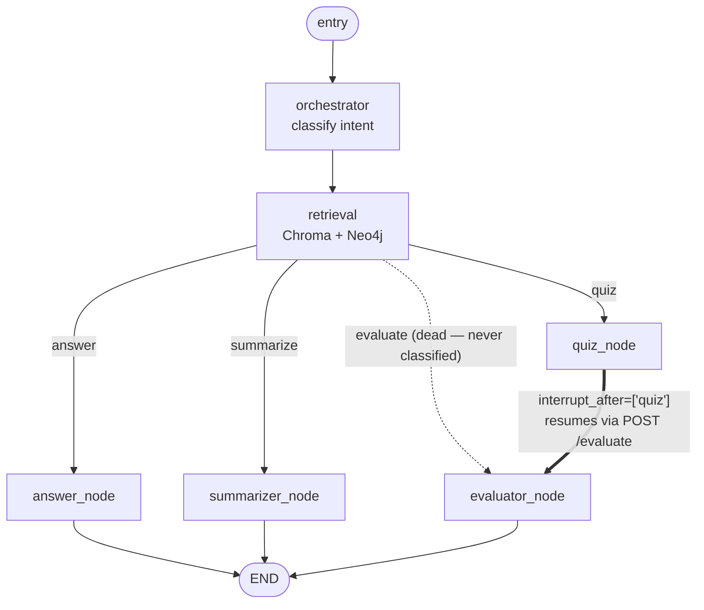

## ER Diagram (Postgres)

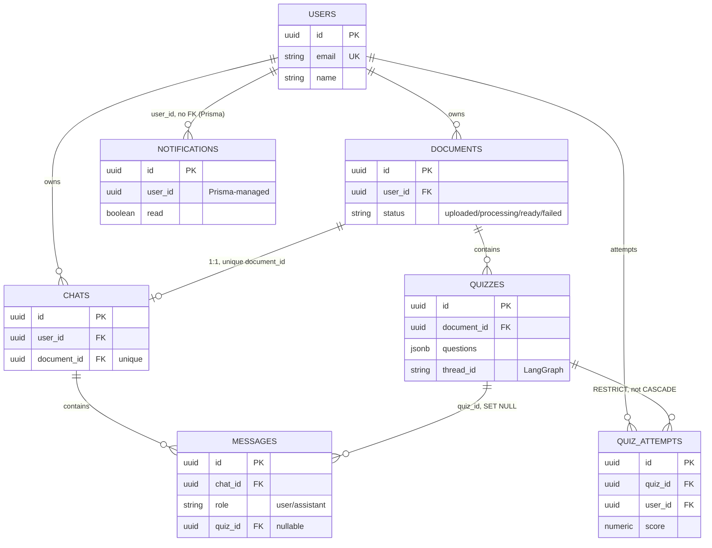

One `edumind` database, two migration tools: Alembic owns everything except `notifications`, which Prisma owns — no cross-schema FK between them.

## Flows

### Upload

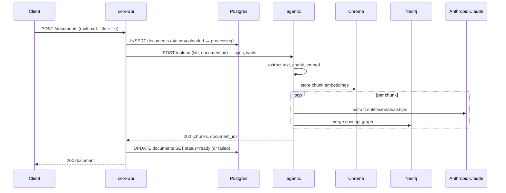

### Message (ask / quiz / summarize)

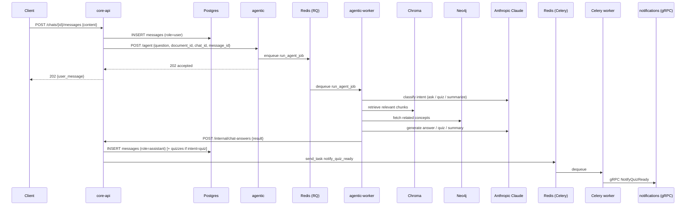

### Evaluate (quiz answer)

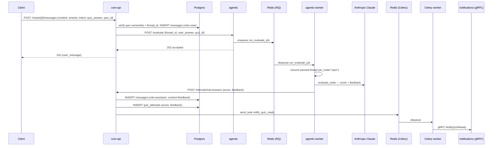

Full hand-traced versions (exact function/table names, error branches, retry behavior) are in `docs/architecture.md`.

## Running Locally

```bash
cp services/agentic/.env.example services/agentic/.env   # add ANTHROPIC_API_KEY
make up                                                  # docker-compose up --build, every service
cd services/core-api && alembic upgrade head              # core-api tables
cd services/notifications && npx prisma migrate deploy    # notifications table
```

## Observability

| | URL |
|---|---|
| Prometheus | http://localhost:9090 |
| Grafana | http://localhost:3000 |

`core-api` exposes `/metrics`, scraped every 15s.


Every LangGraph node run is traced in LangSmith.
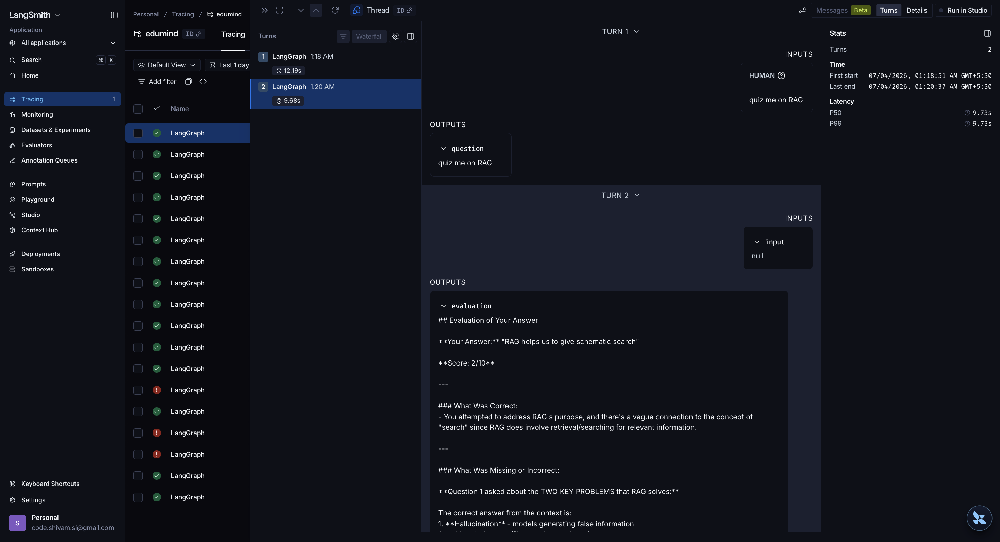

## Testing

```bash
cd services/core-api && pytest tests/ -v        # needs postgres running (make up)
cd services/notifications && npm test
```

**RAGAs eval** (`services/agentic/eval`, 30-question golden dataset, Claude as judge):

| Metric | Score |
|--------|-------|
| Faithfulness | 1.00 |
| Answer Relevancy | 0.90 |
| Context Precision | 0.70 |
| Context Recall | 1.00 |

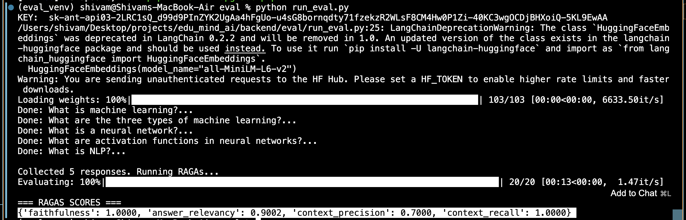

## MCP

| Tool | Description |
|------|-------------|
| `query_curriculum(question)` | grounded answer |
| `get_related_concepts(topic)` | related concepts from the graph |
| `generate_quiz(topic, num_questions)` | quiz from curriculum |

`docker compose up` starts `mcp-server` on `:8003` (streamable-http), add below to `claude_desktop_config.json` in Claude desktop, then restart:
```json
{
  "mcpServers": {
    "edumind": { "url": "http://localhost:8003/mcp" }
  }
}
```

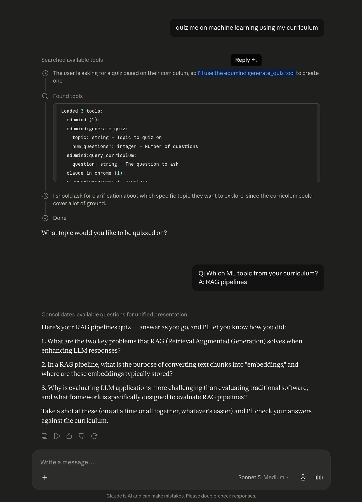
