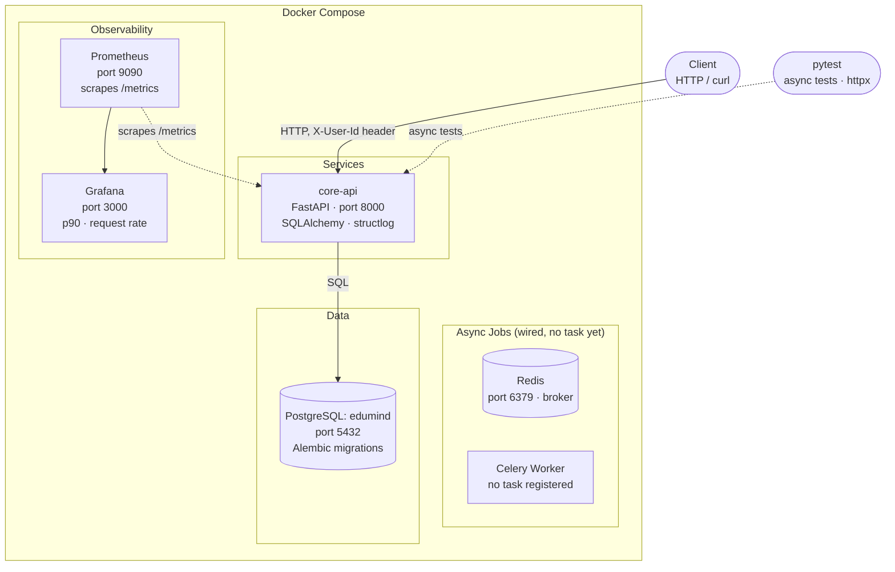

# Backend in python — refresher — EduMind

A minimal project to refresh hands-on familiarity with backend infrastructure in python: async APIs, ORM + migrations, background jobs, observability, and containerisation, built around a trivial study-assistant domain (EduMind: upload a document, generate a quiz from it, record attempts). Each technology is wired in just enough to work; none are used in depth.


## Architecture Overview



## Tech Stack

- **FastAPI** — REST API framework
- **PostgreSQL** — primary database
- **SQLAlchemy + Alembic** — ORM and migrations
- **Redis + Celery** — wired for background jobs, no task registered yet
- **structlog** — structured JSON logging
- **Prometheus** — metrics scraping
- **Grafana** — metrics visualisation
- **Docker** — containerised infrastructure

## Services

- **core-api** (port 8000) — study-assistant domain: users, documents, quizzes generated from documents, and quiz attempts. No auth system — identity is a plain `X-User-Id` header, validated against the `users` table.

## Running Locally

### Prerequisites
- Docker + Docker Compose
- make

### Start everything

```bash
make up
```

### Run migrations

```bash
cd services/core-api
alembic upgrade head
```

### Run tests

```bash
cd services/core-api
pytest tests/ -v
```

## API Endpoints

| Method | Endpoint | Description |
|--------|----------|-------------|
| POST | `/documents` | Create a document (owned by the caller) |
| GET | `/documents` | List the caller's documents |
| GET | `/documents/{id}` | Get a document (404 if not the caller's) |
| PATCH | `/documents/{id}` | Update a document (404 if not the caller's) |
| DELETE | `/documents/{id}` | Delete a document (404 if not the caller's) |
| POST | `/quizzes` | Create a quiz on one of the caller's documents |
| GET | `/quizzes` | List quizzes on the caller's documents |
| GET | `/quizzes/{id}` | Get a quiz (404 if its document isn't the caller's) |
| PATCH | `/quizzes/{id}` | Update a quiz (404 if its document isn't the caller's) |
| DELETE | `/quizzes/{id}` | Delete a quiz (404 if its document isn't the caller's) |
| POST | `/quiz_attempts` | Record an attempt (score is client-supplied) against one of the caller's quizzes |
| GET | `/quizzes/{id}/stats` | Aggregate stats (`avg_score`, `attempt_count`) for a quiz (404 if not the caller's) |
| GET | `/health` | Health check |

All ownership checks return 404, never 403, so cross-user probing can't distinguish "doesn't exist" from "not yours."

## Observability

Prometheus and Grafana are included in the Docker setup.

| Service | URL |
|---------|-----|
| Prometheus | http://localhost:9090 |
| Grafana | http://localhost:3000 |

`core-api` exposes a `/metrics` endpoint scraped by Prometheus every 15s. Open Grafana at http://localhost:3000, add Prometheus as a datasource (http://prometheus:9090), and query metrics like http_requests_total for request counts and histogram_quantile(0.90, rate(http_request_duration_seconds_bucket[5m])) for p90 latency.


## Build Phases

### Phase 1 — FastAPI + PostgreSQL
- Set up the service with FastAPI and an async PostgreSQL connection via `asyncpg`.

### Phase 2 — Alembic Migrations
- Introduced Alembic for schema versioning. Migration scripts handle table creation and column changes, keeping the database schema in sync across environments without manual SQL.

### Phase 3 — Idempotency (superseded)
- The original lending domain added idempotency-key support on application creation. No longer applicable — removed along with the lending domain in Phase 6.

### Phase 4 — Celery + Redis
- Wired up Redis as a task broker and Celery as a worker, originally for an async credit-check job. Kept wired through the domain rewrite (Phase 6) for a future async job; no task is currently registered.

### Phase 5 — Kafka (removed)
- Kafka (KRaft mode) previously carried an event between two lending services. Removed entirely — see git history if you need it.

### Phase 6 — EduMind domain rewrite
- Replaced the lending domain (`LoanApplication`, a second `ledger` service for double-entry bookkeeping) with EduMind's study-assistant domain: `users`, `documents`, `quizzes`, `quiz_attempts`, all ownership-scoped via `X-User-Id`.
- Consolidated to a single service, `core-api`, and renamed the shared database to `edumind`.

### Phase 7 — Docker
- Containerised the service with its own Dockerfile.
- `docker-compose.yml` orchestrates core-api, the Celery worker, PostgreSQL, and Redis with healthchecks and dependency ordering. A `Makefile` wraps common commands (`make up`, `make down`, `make logs`).

### Phase 8 — Observability
- Added `prometheus-fastapi-instrumentator` to expose a `/metrics` endpoint.
- Prometheus scrapes metrics every 15s.
- Grafana visualises request rate, p90 latency, and error rates per endpoint — giving production-style visibility into the running system.
