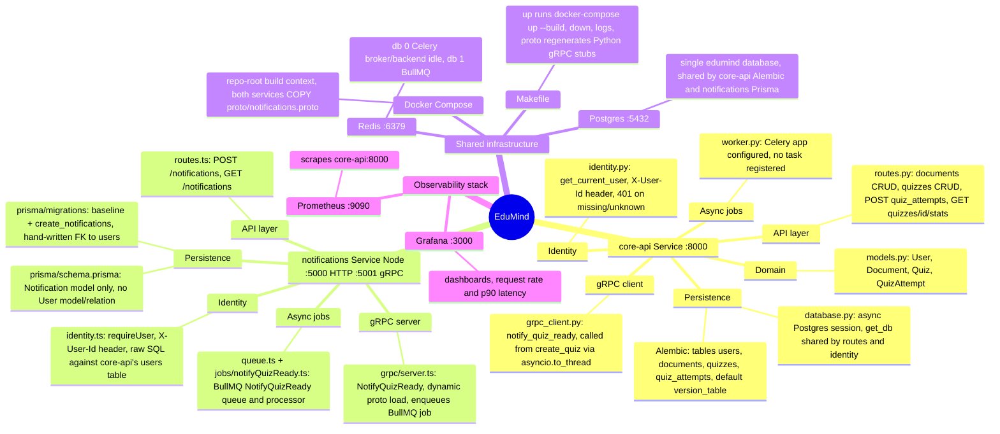
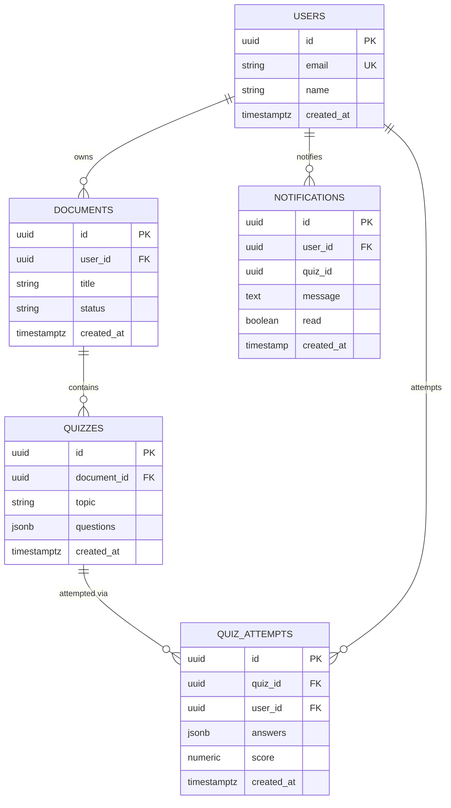
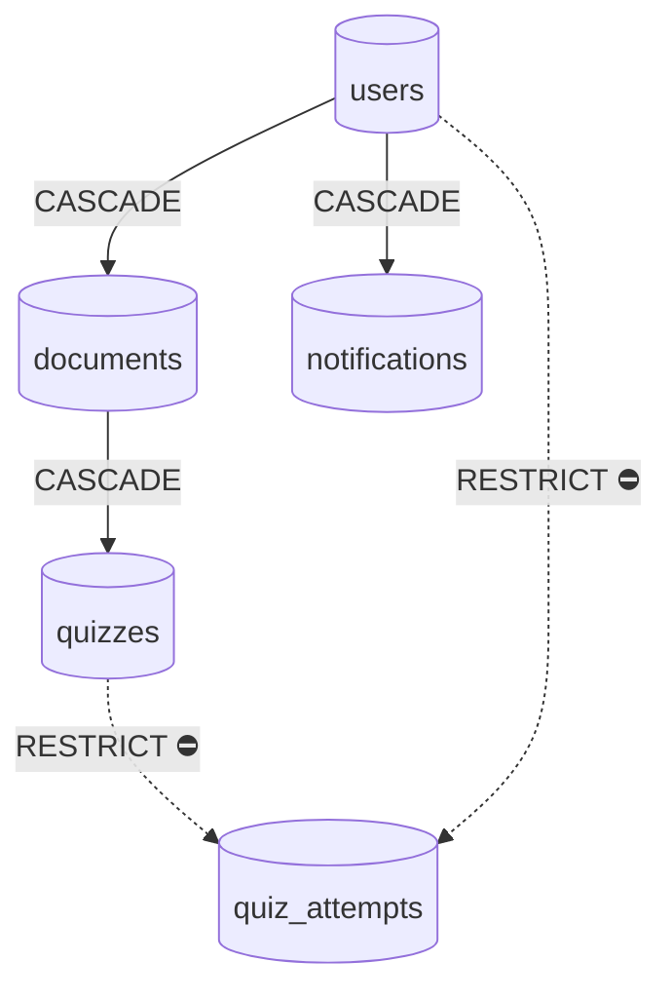
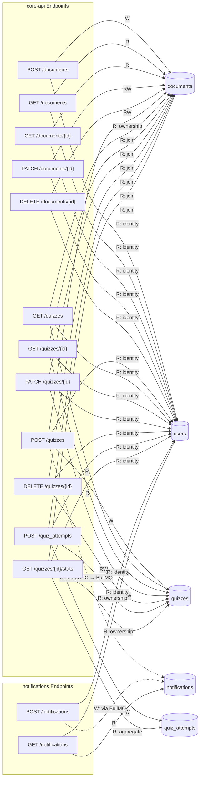
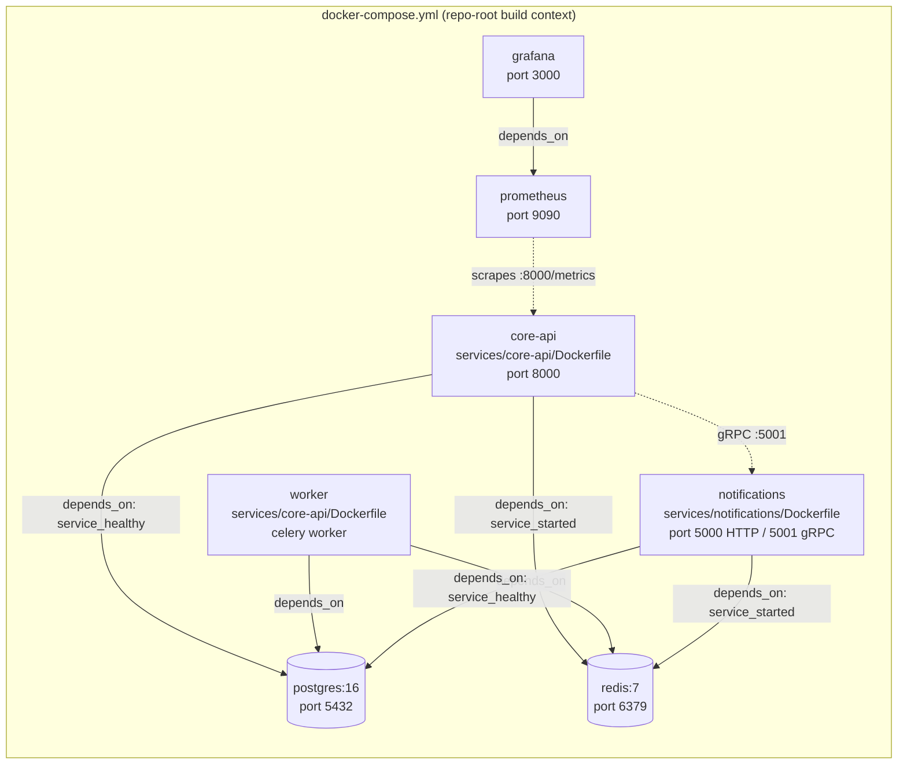
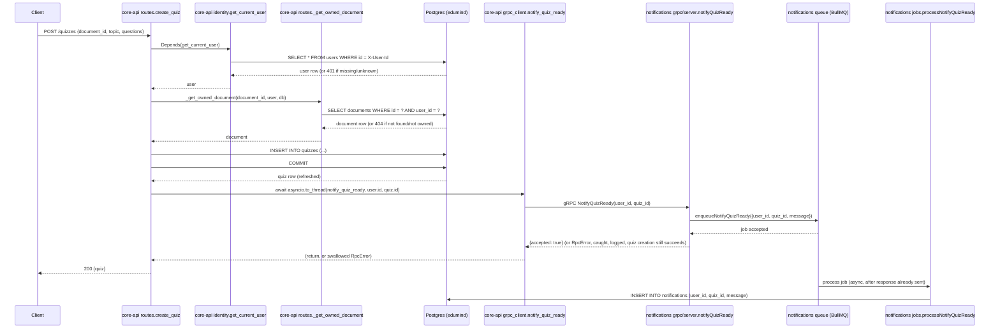

# Architecture

Generated by /arch on 2026-07-19.

## Code Structure

## Database Schema

## Delete Behavior

Legend: solid `CASCADE` — deleting the parent row deletes its children too. Dashed `RESTRICT ⛔` — deleting the parent is blocked at the DB level while child rows exist.

## Data Access Map

## Deployment

## Request Flow

