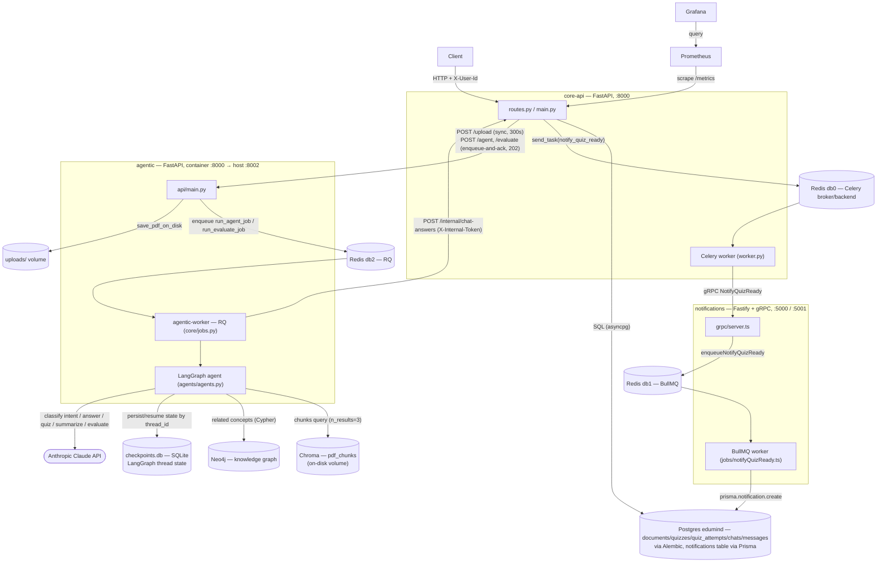
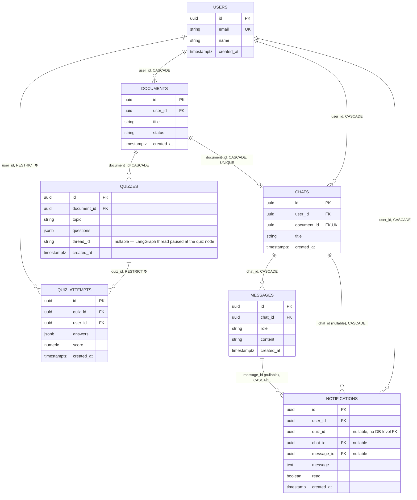
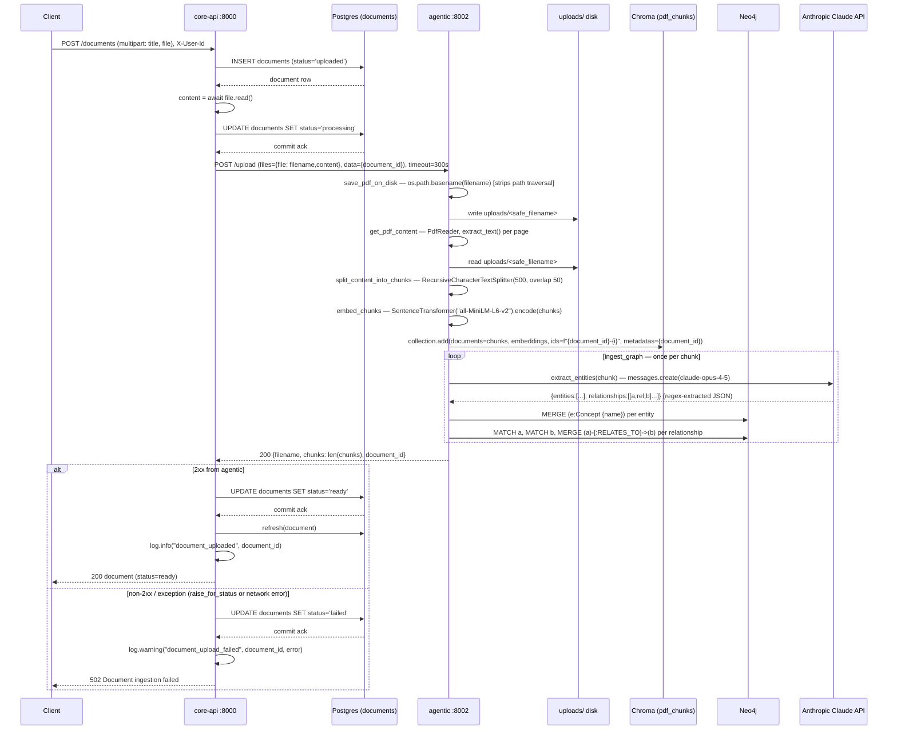

# Architecture

Hand-updated on 2026-07-28 (the `/arch` command that used to regenerate this
no longer exists upstream — see CLAUDE.md's Gotchas — so everything below is
a manually captured, point-in-time trace against the current
`services/core-api`, `services/agentic`, and `services/notifications`
sources, not an auto-regenerating artifact). This revision folds in the
async chat/RQ pipeline (`docs/superpowers/plans/2026-07-26-async-chat-rq-pipeline.md`)
and the quiz-answer evaluation flow merged in `1674c4f`, both of which
post-date the previous version of this file.

2026-07-28: document creation and file upload merged into one atomic
multipart `POST /documents` (the old two-call `POST /documents` +
`POST /documents/{id}/upload` flow is gone — a title-only document can no
longer exist), and `chats.document_id` became unique — a document has at
most one chat, and `POST /chats` is idempotent per `document_id`.

## High-Level Design



Notes the diagram's edges alone don't make obvious:
- One Redis container, **three logical DBs, three unrelated queueing
  systems** that never talk to each other directly: db0 is Celery
  (core-api → notify dispatch), db1 is BullMQ (notifications' own queue),
  db2 is RQ (agentic's job queue, its first and only one). The only bridge
  between the Celery side and the BullMQ side is the synchronous gRPC call
  `core-api`'s Celery worker makes to `notifications`.
- `core-api ↔ agentic` is a two-way HTTP relationship, not just
  core-api-calls-agentic: agentic's RQ worker calls back into core-api's
  `/internal/chat-answers` once a job finishes. That endpoint takes an
  `X-Internal-Token` header (not `X-User-Id`) and derives the owning user
  from the `Chat` row, not from a caller-supplied identity.
- `services/agentic`'s own `CLAUDE.md` documents three things this diagram
  can't: Chroma retrieval is scoped by `document_id`, the Neo4j graph is
  deliberately left global (unscoped, so `related_concepts` can surface
  entities from other documents), and re-uploading the same `document_id`
  is unsupported (Chroma has no upsert path today).
- `agentic`'s FastAPI process (`AAPI`) never imports the LangGraph agent,
  Anthropic client, or SQLite checkpoint connection — `job_queue.enqueue`
  is called with jobs as **string references** (e.g.
  `"core.jobs.run_agent_job"`), so only the RQ worker process (`AWorker`)
  ever loads `agents.agents`.
- `/upload` stays a synchronous, blocking call from core-api's perspective
  (Decision, `CLAUDE.md`) — everything else agentic does for chat
  (`/agent`, `/evaluate`) is now enqueue-and-ack.

## ER Diagram



Two things worth knowing about `QUIZZES`/`NOTIFICATIONS` that the diagram's
edges alone don't make obvious:
- `quizzes.thread_id` only exists because quiz creation now always comes
  from the chat-intent path (see the message-flow diagram below) — it's
  the LangGraph `thread_id` the quiz node paused on, needed later so the
  quiz-answer evaluation flow can resume that exact paused graph state.
  There is no longer a client-facing `POST /quizzes` that creates a quiz
  without one.
- `notifications.quiz_id` was never a real foreign key at the database
  level (even before it became nullable) — it's a plain `UUID` column,
  application-enforced only. `chat_id`/`message_id`, added when the notify
  pipeline was generalized for chat answers, **are** real `CASCADE` foreign
  keys into `chats`/`messages`. A given row has either `quiz_id` set
  (quiz-ready) or `chat_id`/`message_id` set (chat-answer/quiz-answer),
  never a dedicated `kind` column — the populated column *is* the
  discriminator.

## Request Flow — POST /documents (atomic create + upload)

Rewritten 2026-07-28 — document creation and file upload used to be two
calls (`POST /documents` with a title-only JSON body, then
`POST /documents/{document_id}/upload` with the file), which allowed a
title-only document with no file ever reaching agentic. Now it's one
multipart call: title and file arrive together, and the document row
doesn't exist until both are in hand. Everything past the initial
create/commit (agentic ingestion, status transitions) is unchanged from
before — still synchronous end-to-end (Decision, `CLAUDE.md`: deferred to
Celery only if upload latency becomes a real problem).



Notable detail: `extract_entities` is a real Claude API call made once per
chunk, sequentially inside the loop — even a small PDF means several
blocking round-trips to Anthropic before the upload response returns, and
per-call latency is variable enough that this occasionally exceeds even a
generous client-side budget. core-api's httpx timeout for this call was
bumped 120s → 300s on 2026-07-28 after a real upload hit the 120s ceiling
(`services/core-api/agentic_client.py`) — still a flat timeout, not one
budgeted per chunk count, so a large enough document can still exceed it.

## Request Flow — POST /chats/{chat_id}/messages (ask / quiz / summarize)

Rewritten 2026-07-27 — this endpoint used to call agentic synchronously and
return `200 {user_message, assistant_message}` in one round-trip. It's now
**202 fire-and-forget**: core-api hands the question to agentic's RQ queue
and returns immediately; the assistant reply lands later via a callback and
is only visible through `GET /chats/{chat_id}/messages`. This diagram
covers `intent` unset (or anything other than `"quiz_answer"`) — see the
next diagram for the quiz-answer-evaluation branch of this same endpoint.

```mermaid
sequenceDiagram
    participant C as Client
    participant API as core-api :8000
    participant PG as Postgres (chats/messages/quizzes)
    participant A as agentic :8002
    participant RQ as Redis db2 (RQ)
    participant AW as agentic-worker (RQ worker)
    participant CH as Chroma (pdf_chunks)
    participant N as Neo4j
    participant CL as Anthropic Claude API
    participant SQ as checkpoints.db (SQLite)
    participant R0 as Redis db0 (Celery)
    participant CW as Celery worker
    participant GS as notifications gRPC :5001

    C->>API: POST /chats/{chat_id}/messages {content}, X-User-Id
    API->>PG: SELECT chats WHERE id=? AND user_id=? (404 if not owned)
    API->>PG: INSERT messages (role='user', content), COMMIT
    PG-->>API: user_message row
    Note right of API: user message durably committed before the agentic call —<br/>a downstream failure still leaves it persisted for retry

    API->>A: POST /agent {question, document_id, chat_id, message_id}, timeout=10s
    A->>A: validate chat_id/message_id present (400 if missing)
    A->>RQ: enqueue "core.jobs.run_agent_job"(question, document_id, chat_id, message_id)
    A-->>API: 202 {accepted: true}

    alt enqueue call succeeded
        API->>API: log.info("chat_message_dispatched", chat_id, user_id)
        API-->>C: 202 {user_message}
    else non-2xx / exception
        API->>API: log.warning("chat_message_agentic_dispatch_failed", chat_id, error)
        API-->>C: 502 Failed to dispatch question to agentic
        Note right of API: user_message row stays either way — client can retry
    end

    Note over RQ,GS: everything below happens off the request/response cycle

    RQ->>AW: worker dequeues run_agent_job
    AW->>AW: thread_id = uuid4(); agent.invoke({question, document_id}, config={thread_id})
    AW->>CL: orchestrator_node — classify intent ("answer"/"quiz"/"summarize"), max_tokens=50
    CL-->>AW: intent
    AW->>AW: retrieval_node — embed_ques(question) via local SentenceTransformer
    AW->>CH: collection.query(embedding, n_results=3, where={document_id})
    CH-->>AW: chunks
    AW->>CL: extract_entities(question) — for get_related_from_graph
    CL-->>AW: entities JSON
    AW->>N: get_related_concepts(entity) per entity
    N-->>AW: related_concepts

    alt intent == answer
        AW->>CL: answer_node — get_ans_from_claud(question, chunks, related_concepts)
        CL-->>AW: answer text
    else intent == quiz
        AW->>CL: quiz_node — generate 3 quiz questions from chunks
        CL-->>AW: quiz_questions
        Note right of AW: interrupt_after=["quiz"] — graph pauses here;<br/>evaluate_node does not run in this flow
    else intent == summarize
        AW->>CL: summarizer_node — summarize chunks into study notes
        CL-->>AW: summary
    end
    AW->>SQ: checkpointer persists graph state under thread_id

    AW->>API: POST /internal/chat-answers {chat_id, message_id, result: {...state, thread_id}}, X-Internal-Token, timeout=30s
    alt token invalid
        API-->>AW: 401 Invalid internal token
    end
    API->>PG: SELECT chats WHERE id=? (404 if missing — no user check, internal caller)
    API->>API: _extract_answer — result["answer"] if present, else result["feedback"],<br/>else json.dumps(state minus question/document_id)
    API->>PG: INSERT messages (role='assistant', content=answer)
    alt result.intent == "quiz"
        API->>PG: INSERT quizzes (document_id, topic=result.question,<br/>questions=result.quiz_questions, thread_id=result.thread_id)
    end
    API->>PG: COMMIT, refresh rows

    API->>R0: celery_app.send_task("notify_quiz_ready", args=[user_id],<br/>kwargs={quiz_id, chat_id, message_id})
    Note right of API: fire-and-forget — dispatch failure is only logged
    R0->>CW: worker pulls "notify_quiz_ready" off the broker queue
    CW->>GS: gRPC NotifyQuizReady(user_id, quiz_id?, chat_id, message_id), timeout=5s
    Note right of GS: enqueues into notifications' own BullMQ queue (Redis db1),<br/>which a separate worker drains into Postgres — see HLD notes
    alt gRPC call raises
        CW->>CW: self.retry(countdown=RETRY_COUNTDOWN), max_retries=3
    end
```

Notable details: three separate Claude calls happen per message (intent
classification, entity extraction for the graph lookup, and the
answer/quiz/summary generation itself). There is **no retry** on the
agentic-worker → core-api callback (`POST /internal/chat-answers`) — if
that call fails, the assistant message and any auto-created quiz simply
never appear; only the user message row and a printed log line survive
(`run_agent_job`'s `except` block). A quiz created this way uses the
triggering message's content, verbatim, as `topic` — there's no separate
"topic" input on this endpoint.

## Request Flow — quiz-answer evaluation (POST /chats/{chat_id}/messages, intent="quiz_answer")

New 2026-07-27 (merged in `1674c4f`) — the human-in-the-loop half of the
same LangGraph thread the previous diagram paused. The client answers a
quiz through the same endpoint, tagged with `intent: "quiz_answer"` and the
`quiz_id` being answered; the LangGraph thread that paused after the `quiz`
node resumes and runs the `evaluate` node.

```mermaid
sequenceDiagram
    participant C as Client
    participant API as core-api :8000
    participant PG as Postgres (chats/messages/quizzes/quiz_attempts)
    participant A as agentic :8002
    participant RQ as Redis db2 (RQ)
    participant AW as agentic-worker (RQ worker)
    participant CL as Anthropic Claude API
    participant SQ as checkpoints.db (SQLite)
    participant R0 as Redis db0 (Celery)
    participant CW as Celery worker
    participant GS as notifications gRPC :5001

    C->>API: POST /chats/{chat_id}/messages {content: user_answer, intent: "quiz_answer", quiz_id}, X-User-Id
    API->>PG: SELECT chats WHERE id=? AND user_id=? (404 if not owned)
    API->>PG: SELECT quizzes JOIN documents WHERE quiz.id=? AND documents.user_id=? (404 if not owned)
    alt quiz.thread_id is None
        API-->>C: 409 Quiz has no evaluation thread
    end
    API->>PG: INSERT messages (role='user', content=user_answer), COMMIT
    PG-->>API: user_message row

    API->>A: POST /evaluate {thread_id: quiz.thread_id, user_answer, chat_id, message_id, quiz_id}, timeout=10s
    A->>RQ: enqueue "core.jobs.run_evaluate_job"(thread_id, user_answer, chat_id, message_id, quiz_id)
    A-->>API: 202 {accepted: true}

    alt enqueue call succeeded
        API-->>C: 202 {user_message}
    else non-2xx / exception
        API-->>C: 502 Failed to dispatch question to agentic
    end

    Note over RQ,GS: everything below happens off the request/response cycle

    RQ->>AW: worker dequeues run_evaluate_job
    AW->>AW: config={thread_id}; agent.update_state(config, {user_answer}, as_node="quiz")
    Note right of AW: injects user_answer into the checkpoint as if the<br/>paused "quiz" node had produced it
    AW->>SQ: read/write checkpoint state for thread_id
    AW->>AW: agent.stream(None, config) — resumes graph past the interrupt
    AW->>CL: evaluate_node — score (0-10) + feedback JSON against quiz + context
    CL-->>AW: {"score": ..., "feedback": ...} (falls back to {score:0, feedback: raw text} on parse failure)

    AW->>API: POST /internal/chat-answers {chat_id, message_id,<br/>result: {intent: "quiz_answer", quiz_id, score, feedback}}, X-Internal-Token, timeout=30s
    API->>PG: SELECT chats WHERE id=? (404 if missing)
    API->>API: _extract_answer — no "answer" key, falls back to result["feedback"]
    API->>PG: INSERT messages (role='assistant', content=feedback)

    API->>PG: SELECT quizzes WHERE id=quiz_id
    alt quiz missing, or quiz.document_id != chat.document_id, or score is None
        API-->>AW: 400 Invalid quiz_answer payload
    else valid
        API->>PG: INSERT quiz_attempts (quiz_id, user_id=chat.user_id,<br/>answers={feedback}, score), COMMIT
        PG-->>API: attempt row
    end

    API->>R0: celery_app.send_task("notify_quiz_ready", args=[user_id],<br/>kwargs={quiz_id, chat_id, message_id})
    R0->>CW: worker pulls "notify_quiz_ready"
    CW->>GS: gRPC NotifyQuizReady(user_id, quiz_id, chat_id, message_id), timeout=5s
    Note right of GS: same notify chain as the message-answer flow —<br/>BullMQ (Redis db1) → Prisma insert into notifications
```

Notable details: `score` here is **LLM-graded**, not client-supplied — this
is a separate path from the still-existing, untouched `POST /quiz_attempts`
endpoint, where a client posts its own `answers`/`score` directly and
synchronously with no queue involved at all (still true, unchanged; see
the invariant in `CLAUDE.md` that `quiz_attempts.quiz_id`/`user_id` are
`ON DELETE RESTRICT`, so neither path's rows can be lost to a quiz/user
deletion). `agent.update_state(..., as_node="quiz")` only works because the
graph was compiled with `interrupt_after=["quiz"]` — resuming any other
thread that never paused there would be invalid.
