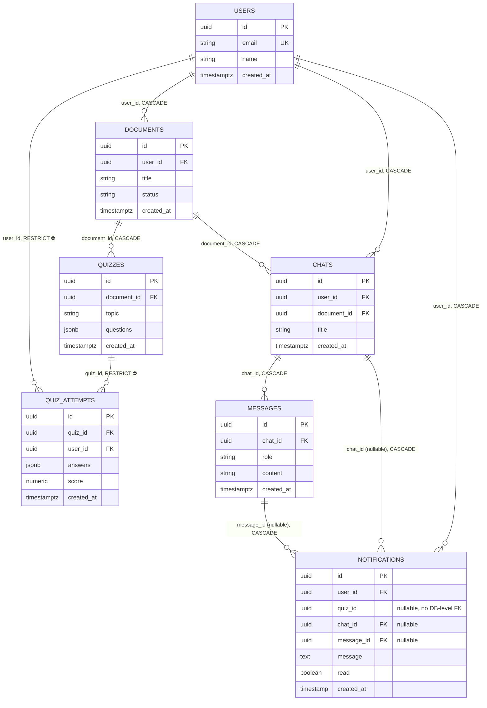
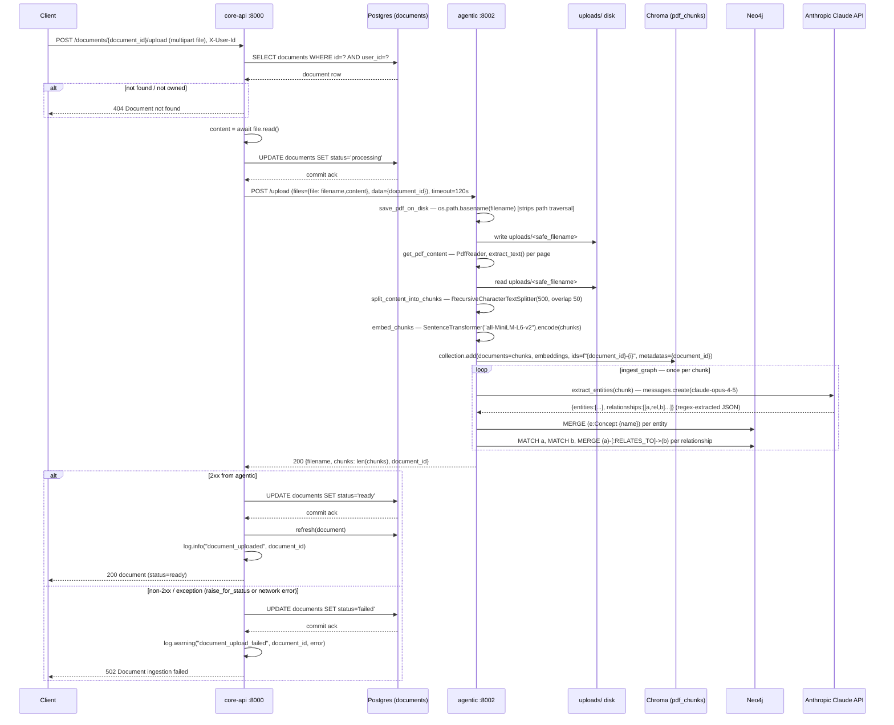
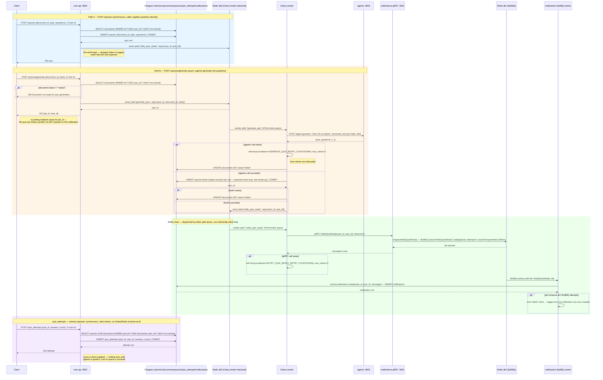

# Architecture

Generated by /arch on 2026-07-27 (`/arch` itself no longer exists upstream —
see CLAUDE.md's Gotchas — this ER diagram was regenerated by hand from the
current `services/core-api/models.py` and
`services/notifications/prisma/schema.prisma`, cross-checked against every
migration file, not just the ORM/schema source).

## ER Diagram



Two things worth knowing about `NOTIFICATIONS` that the diagram's edges
alone don't make obvious:
- `quiz_id` was never a real foreign key at the database level (even before
  it became nullable) — it's a plain `UUID` column, application-enforced
  only. `chat_id`/`message_id`, added when the notify pipeline was
  generalized for chat answers, **are** real `CASCADE` foreign keys into
  `chats`/`messages`.
- A given `NOTIFICATIONS` row now has either `quiz_id` set (a quiz-ready
  notification) or `chat_id`/`message_id` set (a chat-answer notification),
  never a dedicated `kind` column to say which — the populated column *is*
  the discriminator.

## Request Flow — POST /documents/{document_id}/upload

Hand-saved on 2026-07-26 (the `/arch sequence [endpoint]` command that used
to generate this on demand was removed upstream — see CLAUDE.md's Gotchas —
so this is a manually captured, point-in-time trace, not auto-regenerating).



Notable detail: `extract_entities` is a real Claude API call made once per
chunk, sequentially inside the loop — a large PDF means many blocking
round-trips to Anthropic before the upload response returns, all within the
120s httpx timeout core-api holds open to agentic.

## Request Flow — POST /chats/{chat_id}/messages

Hand-saved on 2026-07-26 (same caveat as the upload flow above — manually
captured, not auto-regenerating).

```mermaid
sequenceDiagram
    participant C as Client
    participant API as core-api :8000
    participant PG as Postgres (chats/messages)
    participant A as agentic :8002
    participant CH as Chroma (pdf_chunks)
    participant N as Neo4j
    participant CL as Anthropic Claude API
    participant SQ as checkpoints.db (SQLite)

    C->>API: POST /chats/{chat_id}/messages {content}, X-User-Id
    API->>PG: SELECT chats WHERE id=? AND user_id=?
    PG-->>API: chat row
    alt not found / not owned
        API-->>C: 404 Chat not found
    end
    API->>PG: INSERT messages (role='user', content), COMMIT
    PG-->>API: user_message row
    Note right of API: user message durably committed before the agentic call —<br/>a downstream failure still leaves it persisted for retry

    API->>A: POST /agent {question: content, document_id: chat.document_id}, timeout=60s
    A->>A: thread_id = uuid4(); config={configurable:{thread_id}}
    A->>A: agent.invoke(...) — LangGraph orchestrator entry point

    A->>CL: orchestrator_node — classify intent ("answer"/"quiz"/"summarize"), max_tokens=50
    CL-->>A: intent

    A->>A: retrieval_node
    A->>A: embed_ques(question) — local SentenceTransformer
    A->>CH: collection.query(embedding, n_results=3, where={document_id})
    CH-->>A: chunks
    A->>CL: extract_entities(question) — for get_related_from_graph
    CL-->>A: entities JSON
    A->>N: get_related_concepts(entity) per entity — MATCH (a)-[:RELATES_TO]->(b)
    N-->>A: related_concepts

    alt intent == answer
        A->>CL: answer_node — get_ans_from_claud(question, chunks, related_concepts)
        CL-->>A: answer text
    else intent == quiz
        A->>CL: quiz_node — generate 3 quiz questions from chunks
        CL-->>A: quiz_questions
        Note right of A: interrupt_after=["quiz"] — graph pauses here,<br/>never reaches evaluate_node in this flow
    else intent == summarize
        A->>CL: summarizer_node — summarize chunks into study notes
        CL-->>A: summary
    end

    A->>SQ: checkpointer persists graph state under thread_id
    A-->>API: 200 {...state, intent, thread_id} (answer | quiz_questions | summary)

    alt agentic call succeeded
        API->>API: ask_question — data.get("answer") if present,<br/>else json.dumps(state minus question/document_id)
        API->>PG: INSERT messages (role='assistant', content=answer), COMMIT
        PG-->>API: assistant_message row
        API->>API: log.info("chat_message_created", chat_id, user_id)
        API-->>C: 200 {user_message, assistant_message}
    else non-2xx / exception
        API->>API: log.warning("chat_message_agentic_failed", chat_id, error)
        API-->>C: 502 Failed to get an answer
        Note right of API: no assistant row inserted — user_message row<br/>from above stays, client can retry
    end
```

Notable details: three separate Claude calls happen per message (intent
classification, entity extraction for the graph lookup, and the
answer/quiz/summary generation itself) — not one. And unlike `/upload`,
`ask_question`'s fallback path (`quiz`/`summarize` intents) stores the
*entire* non-answer response body as JSON text in `content`, including the
raw retrieved `chunks` — not a clean quiz or summary string (see
`services/agentic/CLAUDE.md` and this repo's chat-feature plan for why).

## Request Flow — how `quizzes` and `quiz_attempts` get populated

Hand-saved on 2026-07-26 (same caveat as the flows above — manually
captured, not auto-regenerating). Covers both ways a `quizzes` row can be
created, the full Celery/Redis → gRPC → BullMQ → Prisma notify chain
triggered by either one, and — separately — how `quiz_attempts` is
populated (spoiler: no queue is involved there at all).



Notable details: `notify_quiz_ready` is dispatched to the **same Redis
instance, logical DB 0** that Celery already uses as its broker/backend;
`notifications`' BullMQ queue uses **the same Redis instance, logical DB
1** (`REDIS_URL: redis://redis:6379/1` in `docker-compose.yml`) — one Redis
container, two separate queueing systems on two different DB indexes,
never interacting with each other directly (the only bridge between them is
the synchronous gRPC call). `_insert_quiz`/`_mark_document_failed` in
`worker.py` deliberately open a **fresh SQLAlchemy engine per call** instead
of reusing `database.py`'s shared engine — each Celery task body runs
`asyncio.run()` on its own fresh event loop, and asyncpg connections are
bound to the loop that created them.

For a single endpoint's call trace, the old `/arch show flow [endpoint]`
command (mindmap of calls) and `/arch sequence [endpoint]` command no longer
exist — see CLAUDE.md's Gotchas.
