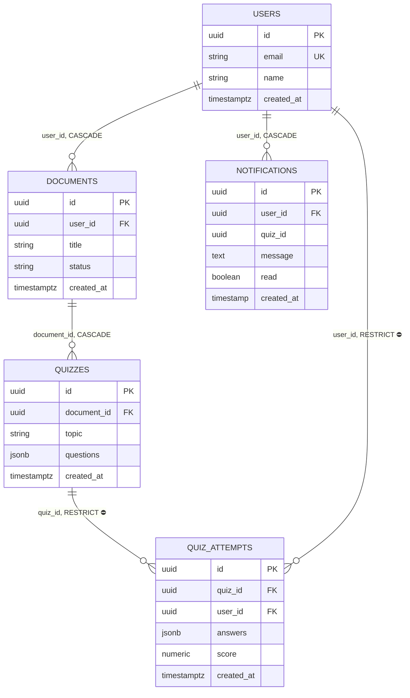

# Architecture

Generated by /arch on 2026-07-20.

## High-Level Architecture

## ER Diagram

For a single endpoint's call trace, run `/arch show flow [endpoint]` (mindmap of calls). For its sequence diagram, run `/arch sequence [endpoint]`.
