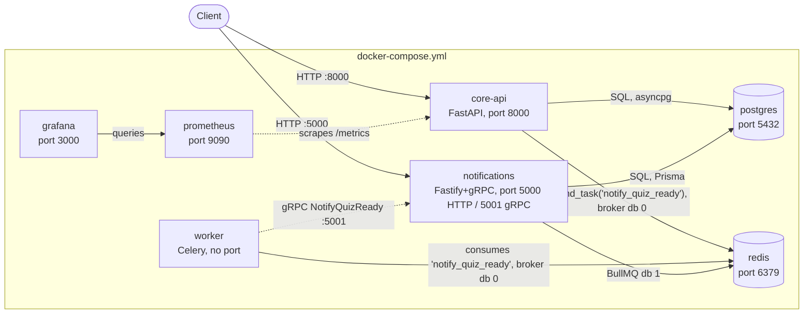
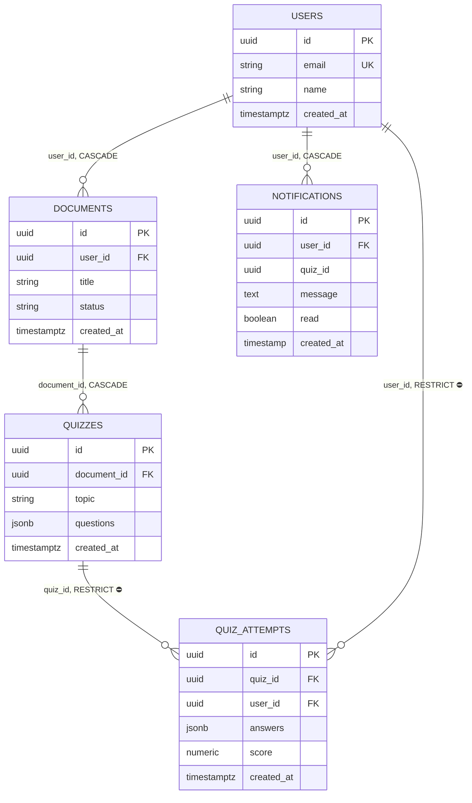
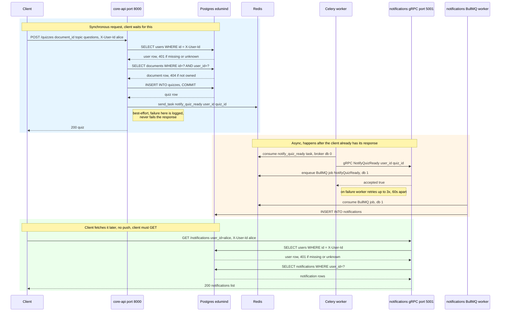

# Architecture

Generated by /arch on 2026-07-20.

## High-Level Architecture

## ER Diagram

## Request Flow — POST /quizzes

Saved on 2026-07-20 via `/arch sequence POST /quizzes` (on-demand trace, hand-saved to this file on request — a plain `/arch` re-run will overwrite the two sections above but has no mechanism to preserve this one; re-save it after any future `/arch` run if you want it kept).

For a single endpoint's call trace, run `/arch show flow [endpoint]` (mindmap of calls). For its sequence diagram, run `/arch sequence [endpoint]`.
