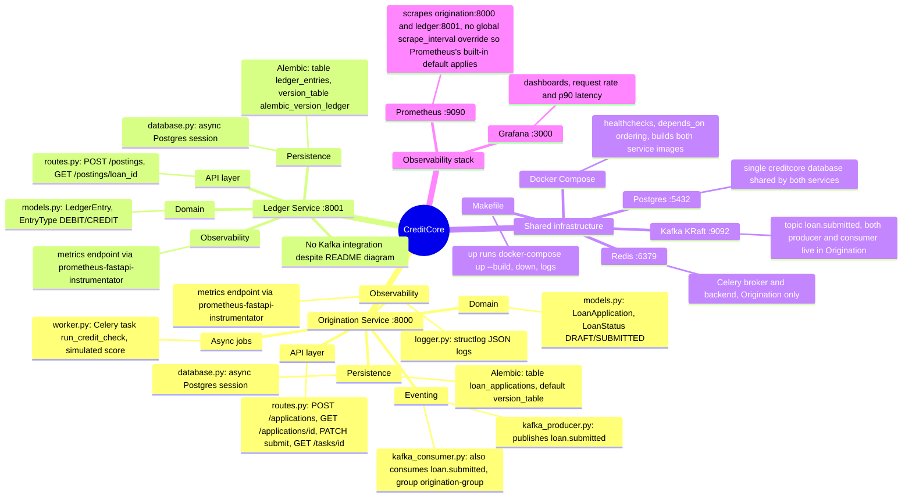
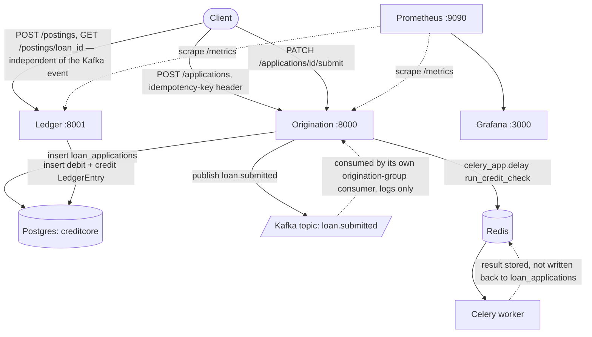

# Architecture

Generated by /arch on 2026-07-15. This file is regenerated — do not hand-edit.

> **Note:** built from direct codebase analysis. `codegraph` (registered in `.mcp.json`) did not surface any tools this session — it needs a Claude Code restart and your approval of the project MCP server first. Regenerate this doc once that's available for a codegraph-verified pass.

## Module map

## Actual data flow

**Discrepancy vs. README:** the top-level `README.md` diagram shows Kafka flowing from Origination into Ledger. That link doesn't exist in code — Ledger has no `kafka` dependency and no consumer. Origination's own consumer subscribes to the topic it publishes and only logs the message; nothing currently bridges the event to Ledger's `/postings` endpoint. Ledger entries are created solely by direct API calls.
