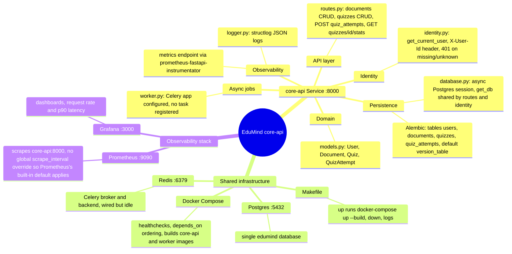
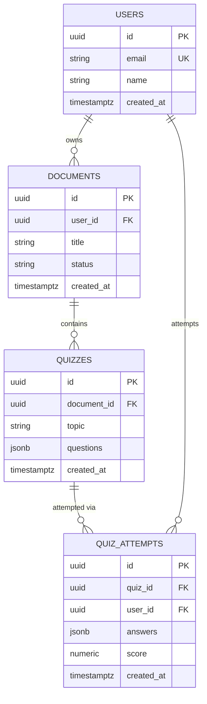
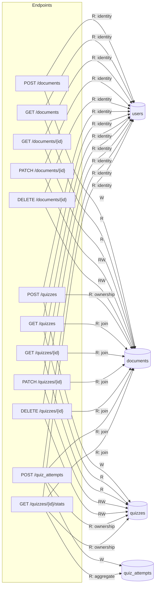
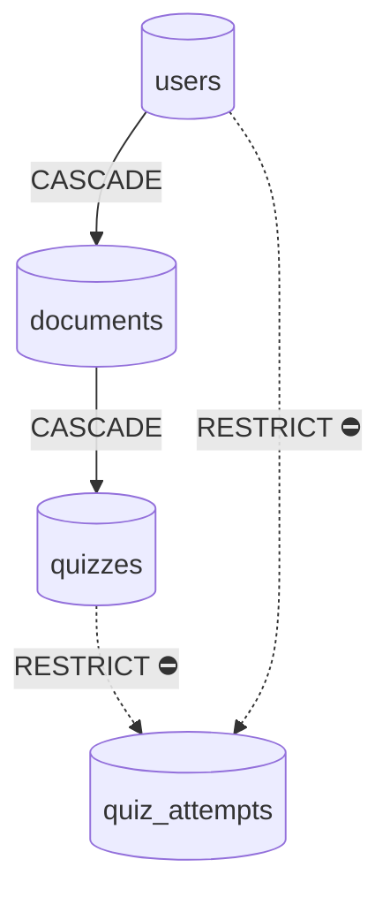

# Architecture

Generated by /arch on 2026-07-17. Architecture, Schema, and Data Access Map are fully regenerated — do not hand-edit them. Delete Behavior is different: any hand-written prose you add below its diagram/legend is preserved across future `/arch` runs.

> **Note:** built from direct codebase analysis. `codegraph` (registered in `.mcp.json`) did not surface any tools this session — it needs a Claude Code restart and your approval of the project MCP server first. Regenerate this doc once that's available for a codegraph-verified pass.

## Architecture

## Schema

## Data Access Map

Every endpoint reads `users` first via the `get_current_user` dependency (`identity.py`) — that's the `R: identity` edge on all twelve. Quiz and quiz_attempt endpoints additionally join back through `documents.user_id` to authorize (`R: join` / `R: ownership`) before touching their own table, per the ownership invariant in CLAUDE.md.

## Delete Behavior

Legend: solid `CASCADE` — deleting the parent row deletes its children too. Dashed `RESTRICT ⛔` — deleting the parent is blocked at the DB level while child rows exist.
