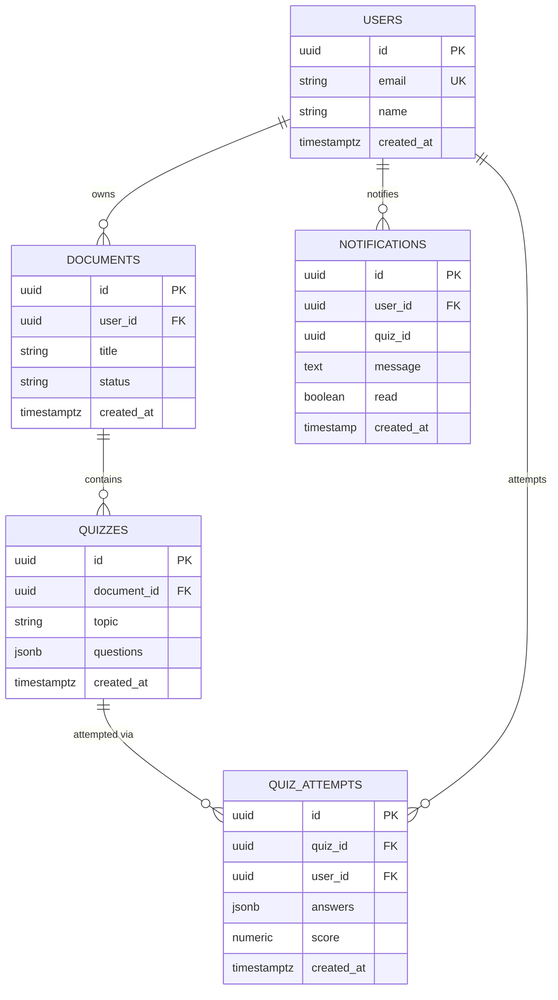
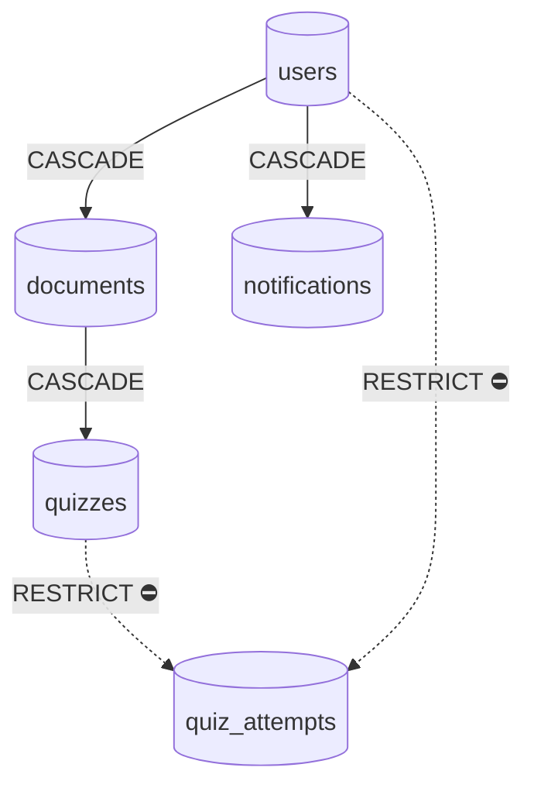
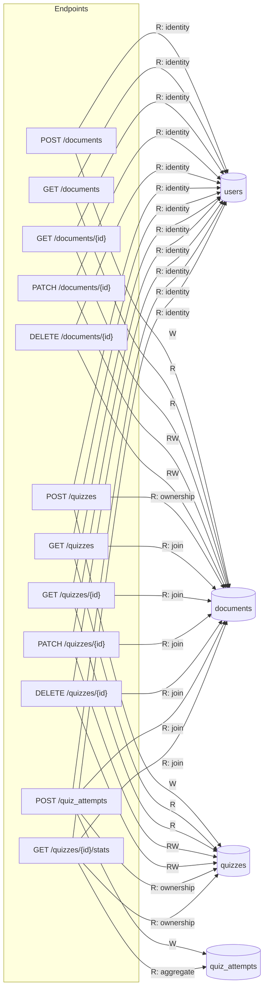
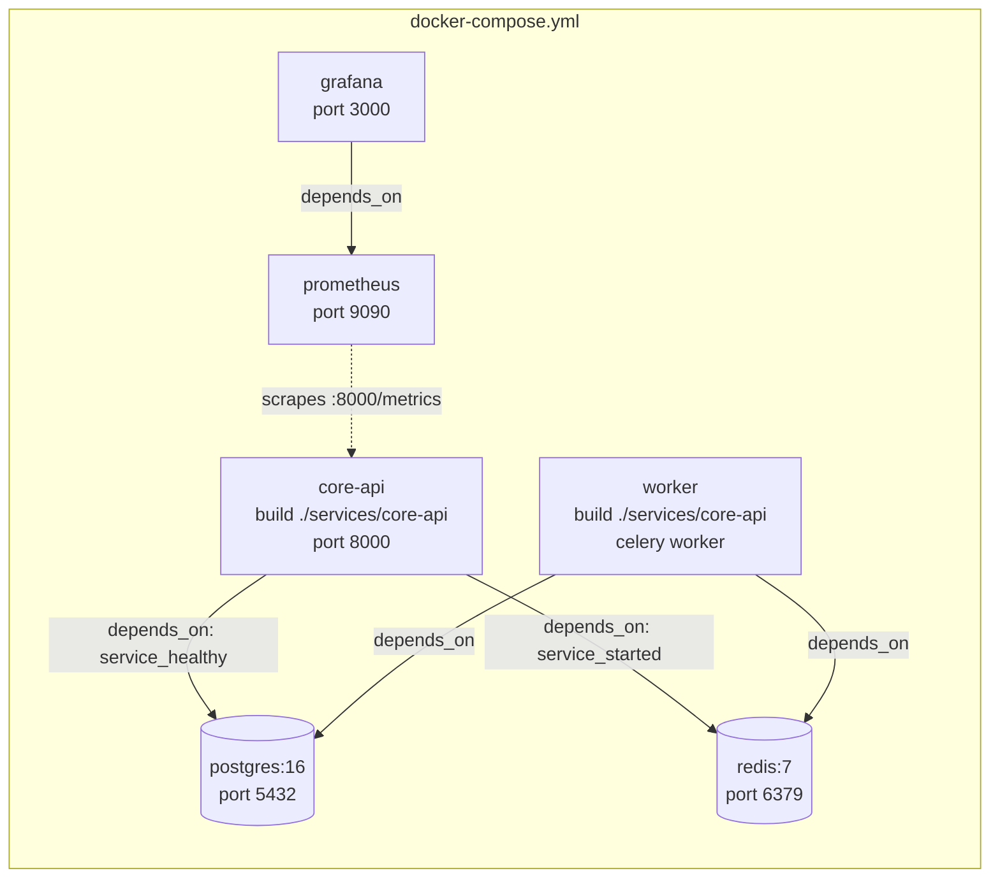
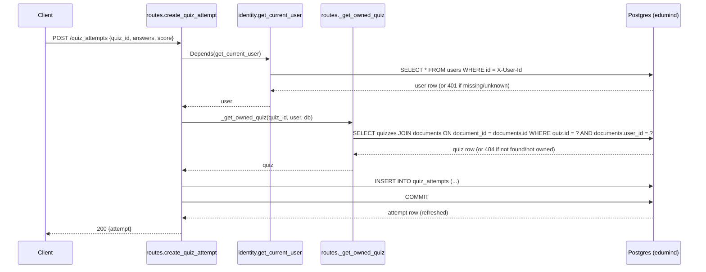

# Architecture

Generated by /arch on 2026-07-18.

## Code Structure

Modules grouped by responsibility, not folder — `core-api` (Python/FastAPI) plus the in-progress `notifications` service (Node/Prisma/gRPC).

```mermaid
mindmap
  root((EduMind))
    core-api Service :8000
      API layer
        routes.py: documents CRUD, quizzes CRUD, POST quiz_attempts, GET quizzes/id/stats
      Domain
        models.py: User, Document, Quiz, QuizAttempt
      Identity
        identity.py: get_current_user, X-User-Id header, 401 on missing/unknown
      Persistence
        database.py: async Postgres session, get_db shared by routes and identity
        Alembic: tables users, documents, quizzes, quiz_attempts, default version_table
      Async jobs
        worker.py: Celery app configured, no task registered
      gRPC codegen
        notifications_pb2 / notifications_pb2_grpc: generated client stubs, not yet called from routes.py
      Observability
        logger.py: structlog JSON logs
        metrics endpoint via prometheus-fastapi-instrumentator
    notifications Service (Node/TypeScript, in progress)
      Identity
        identity.ts: requireUser, X-User-Id header, raw SQL against core-api's users table
      Persistence
        prisma/schema.prisma: Notification model only, no User model/relation
        prisma/migrations: baseline + create_notifications (hand-written FK to users)
      Not yet wired
        no HTTP/gRPC server entrypoint, no job processor
    Shared infrastructure
      Postgres :5432
        single edumind database, shared by core-api (Alembic) and notifications (Prisma)
      Redis :6379
        Celery broker/backend, wired but idle
      Docker Compose
        healthchecks, depends_on ordering, builds core-api and worker images (notifications not yet added)
      Makefile
        up runs docker-compose up --build, down, logs
    Observability stack
      Prometheus :9090
        scrapes core-api:8000
      Grafana :3000
        dashboards, request rate and p90 latency
```

## Database Schema

`users`/`documents`/`quizzes`/`quiz_attempts` are Alembic-owned; `notifications` is Prisma-owned, joined only by a hand-written FK.



## Delete Behavior



Legend: solid `CASCADE` — deleting the parent row deletes its children too. Dashed `RESTRICT ⛔` — deleting the parent is blocked at the DB level while child rows exist.

## Data Access Map

Every endpoint below is in `core-api`; `notifications` has no HTTP/gRPC endpoints wired up yet.



## Deployment

Services and networking as defined in `docker-compose.yml`; `notifications` isn't added to it yet.



## Request Flow

`POST /quiz_attempts` — deepest write chain in the codebase (identity check, then an ownership join through `quizzes`→`documents`, then the insert).


