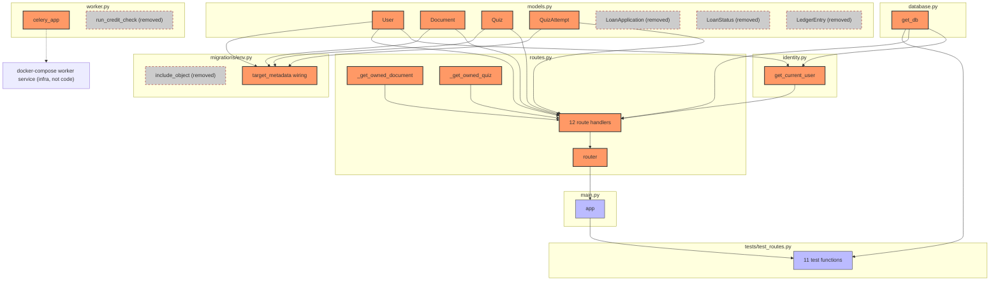
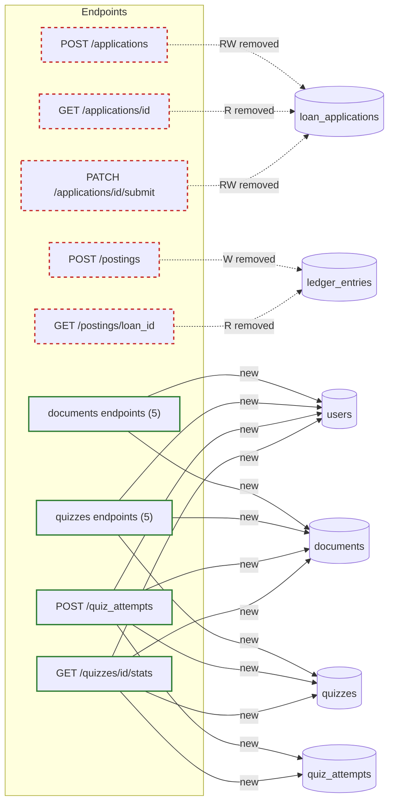

# Blast Radius

Generated by /blast on 2026-07-17 23:56:57. Base ref: `main` (current branch is `main` itself with uncommitted working-tree changes, so `git diff main` == `git diff HEAD`).

> **Note:** built from direct codebase analysis — `codegraph` (registered in `.mcp.json`) did not surface any tools this session. Dependents below were traced via the actual Python import graph and internal call sites, not guessed. Regenerate once codegraph is available for a verified pass.

Diff scope: full EduMind domain rewrite — `services/origination/` and `services/ledger/` deleted, `services/core-api/` added (via rename + rewrite), plus doc/config updates (`CLAUDE.md`, `README.md`, `docker-compose.yml`, `prometheus.yml`, `docs/architecture.md`, `.claude/commands/arch.md`). Doc/config-only files carry no function/class symbols and are excluded from the table below.

## Code Impact

| Changed symbol | Location | Direct dependents (hop 1) | Transitive dependents (hop 2+) |
|---|---|---|---|
| `_get_owned_document` (new, private helper) | `routes.py` | `get_document`, `update_document`, `delete_document`, `create_quiz` (hop 1) | — (all callers are route handlers invoked by the ASGI framework, not by further Python callers) |
| `_get_owned_quiz` (new, private helper) | `routes.py` | `get_quiz`, `update_quiz`, `delete_quiz`, `create_quiz_attempt`, `get_quiz_stats` (hop 1) | — |
| `get_current_user` (new) | `identity.py` | `routes.py` — every route handler via `Depends(get_current_user)` (hop 1) | `main.py` (hop 2, via `from routes import router`) → `tests/test_routes.py` (hop 3, via `from main import app`) |
| `get_db` (new location — moved out of `routes.py` into `database.py` so `identity.py` and `routes.py` share one dependency-override target) | `database.py` | `identity.py`, `routes.py`, `tests/test_routes.py` (all hop 1, direct `from database import get_db`) | `main.py` (hop 2, via `routes.py`) |
| `User` (new class) | `models.py` | `identity.py`, `routes.py`, `migrations/env.py` (hop 1) | `main.py` (hop 2) → `tests/test_routes.py` (hop 3) |
| `Document` (new class) | `models.py` | `routes.py`, `migrations/env.py` (hop 1) | `main.py` (hop 2) → `tests/test_routes.py` (hop 3) |
| `Quiz` (new class) | `models.py` | `routes.py`, `migrations/env.py` (hop 1) | `main.py` (hop 2) → `tests/test_routes.py` (hop 3) |
| `QuizAttempt` (new class) | `models.py` | `routes.py`, `migrations/env.py` (hop 1) | `main.py` (hop 2) → `tests/test_routes.py` (hop 3) |
| `router` (new `APIRouter`, 12 route handlers registered on it) | `routes.py` | `main.py` (hop 1, `app.include_router(router)`) | `tests/test_routes.py` (hop 2, via `from main import app`) |
| `celery_app` (changed — Celery app name `"origination"` → `"core-api"`) | `worker.py` | none in Python code (confirmed: nothing in `services/core-api` imports `worker` anymore — the old `/tasks/{task_id}` endpoint and its `celery_app`/`run_credit_check` imports were dropped in the routes.py rewrite) | `docker-compose.yml`'s `worker` service (`celery -A worker worker`) — infra-level dependent, references the module by CLI convention, not a Python import |
| `include_object` (removed) | `migrations/env.py` | none (was only referenced inside this same file's two `context.configure()` calls, both call sites updated in the same diff) | — |
| `run_credit_check` (removed) | `worker.py` | none (confirmed via repo-wide grep — the only caller, `routes.py`'s old `/applications/{app_id}/submit` handler, no longer exists) | — |
| `LoanApplication`, `LoanStatus` (removed) | `models.py` (deleted, was `services/origination`) | none (confirmed via repo-wide grep — no reference outside the deleted `services/origination/`) | — |
| `LedgerEntry`, `EntryType` (removed) | `models.py` (deleted, was `services/ledger`) | none (confirmed via repo-wide grep — no reference outside the deleted `services/ledger/`) | — |
| `upgrade()`/`downgrade()` in `c1c8df1bcff2_create_edumind_schema.py` (new) | `migrations/versions/` | `e64775fbbdec_seed_test_users.py` (hop 1, chain reference via `down_revision = 'c1c8df1bcff2'` — not a Python import, Alembic's revision-chain walk) | — |
| `upgrade()`/`downgrade()` in `e64775fbbdec_seed_test_users.py` (new) | `migrations/versions/` | none (current head revision, nothing chains after it) | — |



## DB Impact

**Edge list** (endpoint → table → access → status). Baseline = `main` (lending domain: `services/origination` + `services/ledger`). Current = working tree (`services/core-api`). Zero path overlap between the two domains, so every baseline edge is `removed` and every current edge is `new` — nothing `unchanged` or `changed`.

| Endpoint | Table | Access | Status |
|---|---|---|---|
| `POST /applications` | `loan_applications` | RW | removed |
| `GET /applications/{app_id}` | `loan_applications` | R | removed |
| `PATCH /applications/{app_id}/submit` | `loan_applications` | RW | removed |
| `POST /postings` | `ledger_entries` | W | removed |
| `GET /postings/{loan_id}` | `ledger_entries` | R | removed |
| `POST /documents` | `users` | R | new |
| `POST /documents` | `documents` | W | new |
| `GET /documents` | `users` | R | new |
| `GET /documents` | `documents` | R | new |
| `GET /documents/{id}` | `users` | R | new |
| `GET /documents/{id}` | `documents` | R | new |
| `PATCH /documents/{id}` | `users` | R | new |
| `PATCH /documents/{id}` | `documents` | RW | new |
| `DELETE /documents/{id}` | `users` | R | new |
| `DELETE /documents/{id}` | `documents` | RW | new |
| `POST /quizzes` | `users` | R | new |
| `POST /quizzes` | `documents` | R | new |
| `POST /quizzes` | `quizzes` | W | new |
| `GET /quizzes` | `users` | R | new |
| `GET /quizzes` | `documents` | R | new |
| `GET /quizzes` | `quizzes` | R | new |
| `GET /quizzes/{id}` | `users` | R | new |
| `GET /quizzes/{id}` | `documents` | R | new |
| `GET /quizzes/{id}` | `quizzes` | R | new |
| `PATCH /quizzes/{id}` | `users` | R | new |
| `PATCH /quizzes/{id}` | `documents` | R | new |
| `PATCH /quizzes/{id}` | `quizzes` | RW | new |
| `DELETE /quizzes/{id}` | `users` | R | new |
| `DELETE /quizzes/{id}` | `documents` | R | new |
| `DELETE /quizzes/{id}` | `quizzes` | RW | new |
| `POST /quiz_attempts` | `users` | R | new |
| `POST /quiz_attempts` | `documents` | R | new |
| `POST /quiz_attempts` | `quizzes` | R | new |
| `POST /quiz_attempts` | `quiz_attempts` | W | new |
| `GET /quizzes/{id}/stats` | `users` | R | new |
| `GET /quizzes/{id}/stats` | `documents` | R | new |
| `GET /quizzes/{id}/stats` | `quizzes` | R | new |
| `GET /quizzes/{id}/stats` | `quiz_attempts` | R | new |

**Migration SQL** (rendered via `alembic upgrade base:head --sql`, not applied):

```sql
BEGIN;

CREATE TABLE alembic_version (
    version_num VARCHAR(32) NOT NULL,
    CONSTRAINT alembic_version_pkc PRIMARY KEY (version_num)
);

-- Running upgrade  -> c1c8df1bcff2, create edumind schema

DROP TABLE IF EXISTS loan_applications;

CREATE TABLE users (
    id UUID DEFAULT gen_random_uuid() NOT NULL,
    email VARCHAR NOT NULL,
    name VARCHAR NOT NULL,
    created_at TIMESTAMP WITH TIME ZONE NOT NULL,
    PRIMARY KEY (id)
);
CREATE UNIQUE INDEX ix_users_email ON users (email);

CREATE TABLE documents (
    id UUID DEFAULT gen_random_uuid() NOT NULL,
    user_id UUID NOT NULL,
    title VARCHAR NOT NULL,
    status VARCHAR NOT NULL,
    created_at TIMESTAMP WITH TIME ZONE NOT NULL,
    PRIMARY KEY (id),
    CONSTRAINT documents_status_check CHECK (status IN ('uploaded','processing','ready','failed')),
    FOREIGN KEY(user_id) REFERENCES users (id) ON DELETE CASCADE
);
CREATE INDEX ix_documents_user_id ON documents (user_id);

CREATE TABLE quizzes (
    id UUID DEFAULT gen_random_uuid() NOT NULL,
    document_id UUID NOT NULL,
    topic VARCHAR NOT NULL,
    questions JSONB NOT NULL,
    created_at TIMESTAMP WITH TIME ZONE NOT NULL,
    PRIMARY KEY (id),
    FOREIGN KEY(document_id) REFERENCES documents (id) ON DELETE CASCADE
);
CREATE INDEX ix_quizzes_document_id ON quizzes (document_id);

CREATE TABLE quiz_attempts (
    id UUID DEFAULT gen_random_uuid() NOT NULL,
    quiz_id UUID NOT NULL,
    user_id UUID NOT NULL,
    answers JSONB NOT NULL,
    score NUMERIC NOT NULL,
    created_at TIMESTAMP WITH TIME ZONE NOT NULL,
    PRIMARY KEY (id),
    FOREIGN KEY(quiz_id) REFERENCES quizzes (id) ON DELETE RESTRICT,
    FOREIGN KEY(user_id) REFERENCES users (id) ON DELETE RESTRICT
);
CREATE INDEX ix_quiz_attempts_quiz_id ON quiz_attempts (quiz_id);
CREATE INDEX ix_quiz_attempts_user_id ON quiz_attempts (user_id);

INSERT INTO alembic_version (version_num) VALUES ('c1c8df1bcff2');

-- Running upgrade c1c8df1bcff2 -> e64775fbbdec, seed test users

INSERT INTO users (id, email, name, created_at) VALUES
    ('11111111-1111-1111-1111-111111111111', 'alice@edumind.test', 'Alice', '2026-07-17 18:27:38.439149+00:00');
INSERT INTO users (id, email, name, created_at) VALUES
    ('22222222-2222-2222-2222-222222222222', 'bob@edumind.test', 'Bob', '2026-07-17 18:27:38.439149+00:00');

UPDATE alembic_version SET version_num='e64775fbbdec' WHERE alembic_version.version_num = 'c1c8df1bcff2';

COMMIT;
```

**Risky ops flagged:** `DROP TABLE IF EXISTS loan_applications` — an unconditional, ungated data-destructive DROP. Everything else is `CREATE TABLE`/`CREATE INDEX` on brand-new tables (no ALTER on existing tables, no type changes, no missing-default NOT NULL columns, no unindexed-lock risk).



Legend: solid green = new access this diff introduced; dashed red = access this diff removed entirely (no `changed` edges exist — zero endpoint-path overlap between the old and new domains).

**Note:** the Data Access Map in `docs/architecture.md` was already regenerated to match this new schema (via `/arch`, same session) — it is not stale. Flagging per the standard `/blast` template anyway: if you ever land a DB-touching diff without also running `/arch`, re-run it before trusting that doc.

## Untested

- **`list_quizzes` (`GET /quizzes`, plain list)** — zero test coverage, not even a negative-path hit. No test in `tests/test_routes.py` calls `GET /quizzes` without an id. A regression in its ownership filter (`Quiz JOIN Document WHERE Document.user_id == caller`) — e.g. someone dropping the join and returning all quizzes — would ship undetected.
- **`list_documents` (`GET /documents`, plain list) — success path only.** The endpoint is reached in `test_missing_x_user_id_returns_401` and `test_unknown_user_id_returns_401`, but both hit the `get_current_user` dependency's 401 short-circuit before `list_documents`'s body ever runs. Its actual query (`WHERE Document.user_id == caller`) and 200 response are never asserted.
- `celery_app` — no test touches Celery at all (consistent with no task being registered; not a new gap, just zero coverage by construction).
- Alembic `upgrade()`/`downgrade()` functions in both new migration files — never covered by `pytest` (this repo verifies migrations via `alembic upgrade head` + manual inspection, not via the test suite; true of the prior domain too, not a regression introduced by this diff).

Everything else in the closure — `_get_owned_document`, `_get_owned_quiz`, `get_current_user` (both the 401 and success paths), `get_db`, `router`/`app` wiring, and all ten of the other route handlers, including the full cross-user 404 matrix — is exercised by the 11 tests in `tests/test_routes.py`.

## Risk

**Code:** this is a full domain replacement with zero symbol overlap between the old and new endpoint sets, so every dependent of the deleted lending-domain symbols (`LoanApplication`, `LoanStatus`, `LedgerEntry`, `EntryType`, `run_credit_check`, `include_object`) is confirmed dead via repo-wide grep — nothing references them outside their own now-deleted files, so there's no risk of a stale caller breaking at runtime. The new domain's dependency graph is shallow (max 3 hops, `models.py` → `routes.py`/`identity.py` → `main.py` → `tests`) and mostly well-covered, but the two gaps above are real: `list_quizzes` has no test at all, and `list_documents`'s actual filtering logic is never exercised (only its auth guard is). Given the ownership-scoping invariant in `CLAUDE.md` ("ownership checks... return 404, never 403") is the single most security-relevant property of this service, an untested list endpoint is the most likely place a future edit silently breaks it.

**DB:** low risk to live data today — this is a from-scratch migration chain against a brand-new `edumind` database (confirmed via `psql \d` during the earlier verification pass), so nothing real gets dropped in the actual deploy path. The risk is latent: the migration's `DROP TABLE IF EXISTS loan_applications` statement is unconditional and has no corresponding restore in `downgrade()` — if this chain is ever pointed at the old shared `creditcore` database, or any database where `loan_applications` still holds rows, that data is gone with no rollback. All four new tables are freshly created with the correct indexes, the `documents_status_check` CHECK constraint, and the CASCADE/RESTRICT rules from the design spec — no ALTER-on-existing-table risk since nothing pre-existed.
