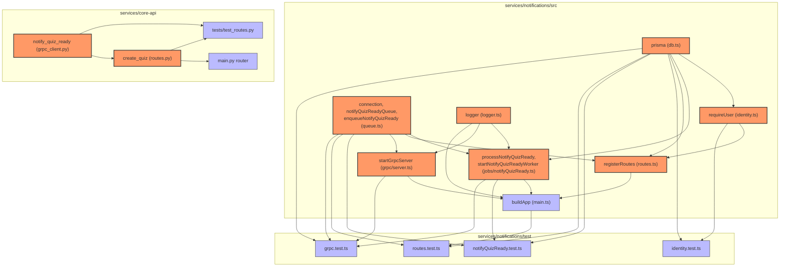
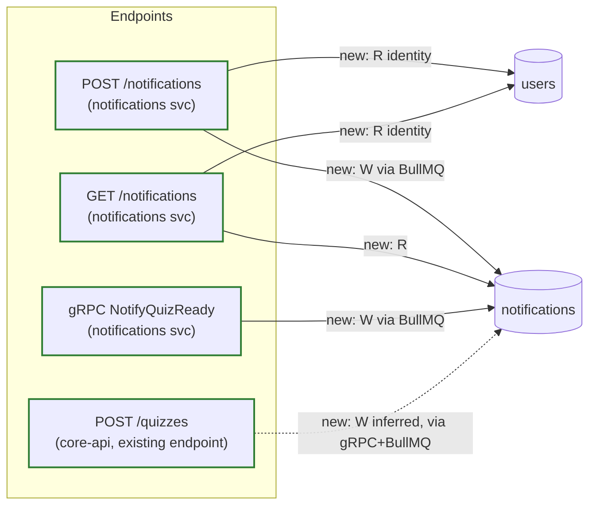

# Blast Radius

Generated by /blast on 2026-07-19 05:21:11. Base ref: `eebc420` (start of the notifications-service feature) → `HEAD` (`main`, current commit `f89f93b`).

> **Note:** the repo is currently on `main` itself with no separate feature branch, so the skill's default `git diff main --name-only` is empty (nothing uncommitted). To demonstrate the new diagram-first `/blast` output on a meaningful diff, the base was set to `eebc420` — the commit immediately before this feature started — covering the full notifications-service addition, its most recent substantial diff. `codegraph` (`.mcp.json`) still did not surface any tools this session; dependents below were traced via the actual import graph (`grep` across every changed file), not guessed.

No `--hops` cap was passed — traced to fixpoint. Deepest closure: hop 3 (Node `identity.ts` → `routes.ts` → `main.ts` → `routes.test.ts`).

## Code Impact

| Changed symbol | Location | Direct dependents (hop 1) | Transitive dependents (hop 2+) |
|---|---|---|---|
| `prisma` (client, new) | `services/notifications/src/db.ts` | `identity.ts`, `jobs/notifyQuizReady.ts`, `routes.ts`, `identity.test.ts`, `notifyQuizReady.test.ts`, `routes.test.ts`, `grpc.test.ts` (all hop 1, direct import) | `main.ts` (hop 2, via `jobs/notifyQuizReady.ts` and `routes.ts`) |
| `requireUser` (new) | `services/notifications/src/identity.ts` | `routes.ts`, `identity.test.ts` | `main.ts` (hop 2) → `routes.test.ts` (hop 3) |
| `connection`, `notifyQuizReadyQueue`, `enqueueNotifyQuizReady`, `NotifyQuizReadyPayload` (new) | `services/notifications/src/queue.ts` | `jobs/notifyQuizReady.ts`, `routes.ts`, `grpc/server.ts`, `notifyQuizReady.test.ts`, `routes.test.ts`, `grpc.test.ts` | `main.ts` (hop 2, via `jobs/notifyQuizReady.ts`/`routes.ts`/`grpc/server.ts`) |
| `processNotifyQuizReady`, `startNotifyQuizReadyWorker` (new) | `services/notifications/src/jobs/notifyQuizReady.ts` | `main.ts`, `notifyQuizReady.test.ts`, `grpc.test.ts` | `routes.test.ts` (hop 2, via `main.ts`) |
| `registerRoutes` (new) | `services/notifications/src/routes.ts` | `main.ts` | `routes.test.ts` (hop 2) |
| `startGrpcServer` (new) | `services/notifications/src/grpc/server.ts` | `main.ts`, `grpc.test.ts` | `routes.test.ts` (hop 2, via `main.ts`) |
| `logger` (new) | `services/notifications/src/logger.ts` | `jobs/notifyQuizReady.ts`, `grpc/server.ts`, `main.ts` | `notifyQuizReady.test.ts`, `grpc.test.ts` (hop 2, via `jobs/notifyQuizReady.ts`) → `routes.test.ts` (hop 2, via `main.ts`) |
| `buildApp` (new) | `services/notifications/src/main.ts` | `routes.test.ts` | — (fixpoint at hop 1, no further importers) |
| `notify_quiz_ready` (new) | `services/core-api/grpc_client.py` | `routes.py` (import), `tests/test_routes.py` (hop 1 — two tests reference it directly via `monkeypatch.setattr("routes.notify_quiz_ready", ...)`, a direct dependency even though not a Python `import`) | `main.py` (hop 2, via `routes.py`'s `router`) |
| `create_quiz` (changed — now calls `notify_quiz_ready`) | `services/core-api/routes.py` | `main.py`'s `router` (pre-existing edge, unchanged by this diff) | `tests/test_routes.py` (pre-existing + 2 new tests target it directly) |

Fixpoint reached at hop 3 for the Node side (`identity.ts`), hop 2 for the Python side (`grpc_client.py`) — no symbol's closure was capped, every hop expansion terminated because the next hop added no new nodes.



## DB Impact



Legend: solid green = new edge this diff introduced (new endpoint or gRPC method reaching a table for the first time). Dashed = inferred/asynchronous — `POST /quizzes` itself never executes SQL against `notifications`; it makes a best-effort gRPC call that, if accepted, causes a BullMQ job in the notifications service to write the row later, in a different process, after the HTTP response has already been sent. No REMOVED or CHANGED edges — every pre-existing core-api endpoint's access to `users`/`documents`/`quizzes`/`quiz_attempts` is untouched by this diff (omitted per UNCHANGED).

```sql
-- 00000000000000_baseline/migration.sql
-- baseline: pre-existing schema (Alembic's tables), not managed by Prisma

-- 20260718040556_create_notifications/migration.sql
CREATE TABLE "notifications" (
    "id" UUID NOT NULL DEFAULT gen_random_uuid(),
    "user_id" UUID NOT NULL,
    "quiz_id" UUID NOT NULL,
    "message" TEXT NOT NULL,
    "read" BOOLEAN NOT NULL DEFAULT false,
    "created_at" TIMESTAMP(3) NOT NULL DEFAULT CURRENT_TIMESTAMP,

    CONSTRAINT "notifications_pkey" PRIMARY KEY ("id")
);

CREATE INDEX "notifications_user_id_idx" ON "notifications"("user_id");

-- Hand-written: users is Alembic's table, not Prisma's
ALTER TABLE "notifications" ADD CONSTRAINT "notifications_user_id_fkey"
    FOREIGN KEY ("user_id") REFERENCES "users"("id") ON DELETE CASCADE ON UPDATE CASCADE;
```

**Risk:** low. Both migrations are additive-only (`CREATE TABLE`/`CREATE INDEX`/one `ALTER TABLE ... ADD CONSTRAINT` on a brand-new table) — no `DROP`, no column-type change, no `NOT NULL` added to an existing populated table, no lock risk on a large existing table. The one op worth naming explicitly: the FK's `ON DELETE CASCADE` on `notifications.user_id` means deleting a `users` row silently deletes that user's notification history too — consistent with the CASCADE already used on `documents.user_id`, but worth knowing since `quiz_attempts` deliberately uses `RESTRICT` for the same kind of relationship (score history is intentionally preserved on delete; notification history is not). The baseline migration (`00000000000000_baseline`) executes no SQL at all — it exists purely as a `prisma migrate resolve --applied` bookkeeping marker, zero risk.

**Docs status:** `docs/architecture.md` was regenerated fresh immediately before this run (commit `f89f93b`) and already reflects every edge shown above — not stale, no re-run of `/arch` needed this time.

## Untested

- **`gRPC NotifyQuizReady` → `notifications` (W)** is exercised end-to-end by `test/grpc.test.ts` (client → server → BullMQ → DB row, polled) — not untested, listing here only to note it's covered by a slower integration-style test rather than a unit test.
- Everything else in the Code Impact closure has direct test coverage: `db.ts`/`identity.ts` via `identity.test.ts`, `queue.ts`/`jobs/notifyQuizReady.ts` via `notifyQuizReady.test.ts`, `routes.ts`/`main.ts` via `routes.test.ts`, `grpc/server.ts` via `grpc.test.ts`, `grpc_client.py`/`create_quiz`'s new call site via the two new Python tests (`test_create_quiz_calls_notify_quiz_ready`, `test_create_quiz_succeeds_even_when_notify_quiz_ready_raises`).
- No untested symbol found in this closure — this diff's own test suite (11 Node + 2 new Python tests) covers every new/changed node in the Code Impact graph above.

## Risk

**Code:** low. Every new symbol in the closure has at least one direct test exercising it (confirmed in Untested above), the closure is shallow (max hop 3) and entirely contained within the new `services/notifications/` tree plus one deliberate integration point in `core-api` (`create_quiz`). The one architectural risk already known and fixed earlier in this feature — `notify_quiz_ready` blocking FastAPI's event loop — was addressed via `asyncio.to_thread` (see `routes.py`), so it doesn't show up as a fresh risk here. The `POST /quizzes → notifications` edge being asynchronous and best-effort (never fails the request, per `try/except grpc.RpcError`) means a `notifications` outage degrades to "no notification sent," not "quiz creation broken" — the failure mode is contained.
