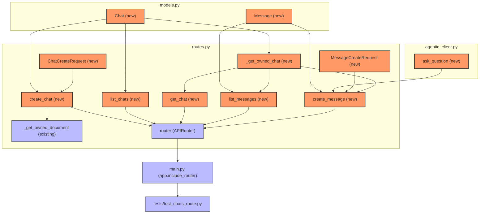
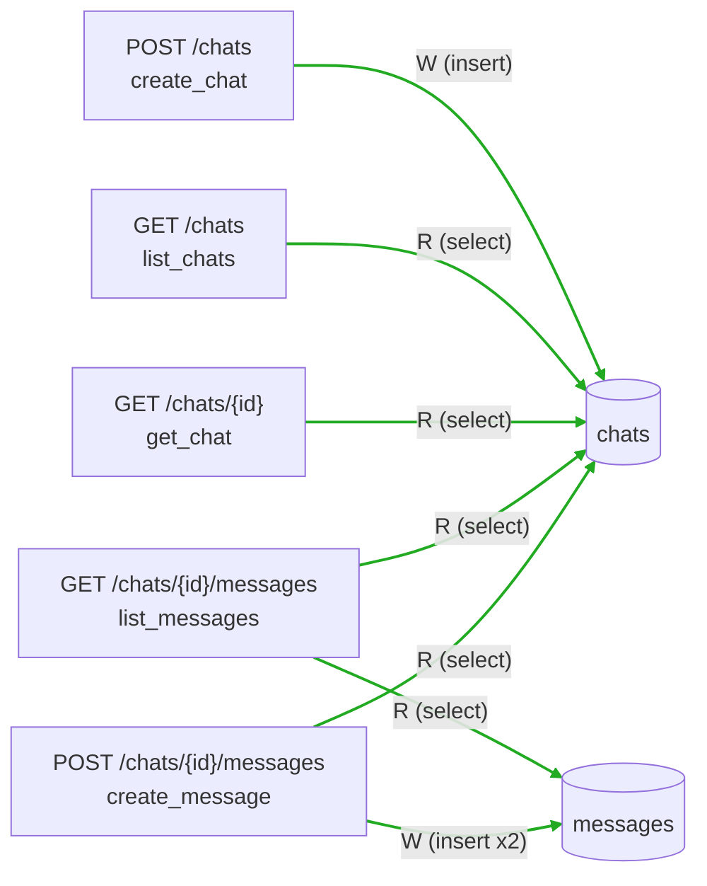

# Blast Radius

Generated by /blast on 2026-07-25 19:02:18. Base ref: `main` (`2eea206`) → `HEAD` (`7a256c8`, branch `phase-b5-chat` — Phase B5 chat-per-document feature).

> **Note:** `codegraph` did not surface any tools this session (MCP server not connected). Dependents below were traced via the actual import graph and call sites (`grep` across every changed file), not guessed.

No `--hops` cap was passed — traced to fixpoint. Deepest closure: hop 2 (`tests/test_chats_route.py` via `main.py`'s router, and `_get_owned_document` gaining `create_chat` as a new caller).

## Code Impact

| Changed symbol | Location | Direct dependents (hop 1) | Transitive dependents (hop 2+) |
|---|---|---|---|
| `ask_question` (new) | `services/core-api/agentic_client.py:18` | `routes.py` (import, line 13), `create_message` (routes.py:310) | — (fixpoint at hop 1; `create_message` has no further importers beyond the router wiring already counted below) |
| `Chat` (new) | `services/core-api/models.py:48` | `routes.py` (import, line 10); constructed/queried by `_get_owned_chat`, `create_chat`, `list_chats` | via `_get_owned_chat`: `get_chat`, `list_messages`, `create_message` (hop 2) |
| `Message` (new) | `services/core-api/models.py:57` | `routes.py` (import, line 10); queried/constructed by `list_messages`, `create_message` | — (fixpoint at hop 1) |
| `_get_owned_chat` (new) | `services/core-api/routes.py:248` | `get_chat` (routes.py:284), `list_messages` (routes.py:290), `create_message` (routes.py:303) | `router`/`main.py` (hop 2, via each caller's route registration) |
| `ChatCreateRequest` (new) | `services/core-api/routes.py:241` | `create_chat` (param type, routes.py:259) | — (fixpoint at hop 1) |
| `MessageCreateRequest` (new) | `services/core-api/routes.py:245` | `create_message` (param type, routes.py:299) | — (fixpoint at hop 1) |
| `create_chat`, `list_chats`, `get_chat`, `list_messages`, `create_message` (new endpoints) | `services/core-api/routes.py:258-320` | `router` (APIRouter, registered via `@router.post`/`@router.get` decorators) | `main.py` (`app.include_router(router)`, pre-existing wiring, unchanged) → `tests/test_chats_route.py` (hop 2, exercises all 5 endpoints over HTTP via `ASGITransport(app=app)`) |
| `_get_owned_document` (existing, unchanged body) | `services/core-api/routes.py:27` | gains one new caller: `create_chat` (routes.py:263, ownership + 409-not-ready check) | no further change — existing hop-1/hop-2 dependents (`get_document`, `update_document`, `delete_document`, `upload_document_file`, `create_quiz`, `generate_quiz_request`, and their tests) are untouched by this diff |

Fixpoint reached at hop 2 for every changed symbol — no symbol's closure was capped by a `--hops` limit; each expansion terminated because the next hop added no new nodes. This is a small, almost entirely additive diff: every new symbol is either a leaf (no existing code calls it yet) or reaches the same pre-existing `main.py` → router wiring within one more hop.



## DB Impact



Legend: all 7 edges above are **NEW** (green) — the `chats` and `messages` tables did not exist at baseline (`main`), so every endpoint/table edge in this diff is new by definition. No REMOVED or CHANGED edges (nothing pre-existing was touched).

Migration SQL (`alembic upgrade e64775fbbdec:d3f6a91c8e27 --sql`, preview only — not applied):

```sql
BEGIN;

CREATE TABLE chats (
    id UUID DEFAULT gen_random_uuid() NOT NULL,
    user_id UUID NOT NULL,
    document_id UUID NOT NULL,
    title VARCHAR,
    created_at TIMESTAMP WITH TIME ZONE NOT NULL,
    PRIMARY KEY (id),
    FOREIGN KEY(user_id) REFERENCES users (id) ON DELETE CASCADE,
    FOREIGN KEY(document_id) REFERENCES documents (id) ON DELETE CASCADE
);

CREATE INDEX ix_chats_user_id ON chats (user_id);

CREATE INDEX ix_chats_document_id ON chats (document_id);

CREATE TABLE messages (
    id UUID DEFAULT gen_random_uuid() NOT NULL,
    chat_id UUID NOT NULL,
    role VARCHAR NOT NULL,
    content VARCHAR NOT NULL,
    created_at TIMESTAMP WITH TIME ZONE NOT NULL,
    PRIMARY KEY (id),
    CONSTRAINT messages_role_check CHECK (role IN ('user','assistant')),
    FOREIGN KEY(chat_id) REFERENCES chats (id) ON DELETE CASCADE
);

CREATE INDEX ix_messages_chat_id ON messages (chat_id);

UPDATE alembic_version SET version_num='d3f6a91c8e27' WHERE alembic_version.version_num = 'e64775fbbdec';

COMMIT;
```

**Risk assessment:** Both statements are plain `CREATE TABLE` + `CREATE INDEX` on brand-new tables — no `ALTER TABLE` on an existing table, no column type change, no `DROP`, and nothing that locks or rewrites existing data. Postgres index creation here is non-`CONCURRENTLY`, but that only matters for locking on tables with existing rows/traffic; `chats`/`messages` are empty new tables at migration time, so the brief lock is a non-issue. No risky ops flagged.

**Summary:** All 7 endpoint/table edges above are new, and the two new tables (`chats`, `messages`) plus their CASCADE edges (`chats.user_id → users`, `chats.document_id → documents`, `messages.chat_id → chats`) are not yet reflected in `docs/architecture.md`'s ER diagram — that diagram is now stale; re-run `/arch` to refresh it.

## Untested

Nothing in the closure is untested — every new symbol is exercised by `tests/test_chats_route.py` (9 tests): both success and 409/404 paths for `create_chat`; `list_chats` (including the newest-first ordering and the cross-user exclusion assertion added during final review); `get_chat`; `list_messages` (ordering); `create_message` (happy path, 502-keeps-user-row, cross-user 404). `_get_owned_document`'s one new call site (from `create_chat`) is covered by the same tests that hit `create_chat`'s 404/409 paths.

## Risk

Code risk is low: this diff is almost entirely additive (five new endpoints, two new ORM classes, one new client function), and the only existing symbol it touches — `_get_owned_document` — gains a new caller without any change to its own body, so its established 404-not-403 behavior and its existing callers (`get_document`, `update_document`, `delete_document`, `upload_document_file`, `create_quiz`, `generate_quiz_request`) are unaffected. The one cross-cutting dependency worth naming is `ask_question`'s JSON-serialize fallback for non-`answer` `/agent` intents (`quiz`/`summarize`) — a deliberate, already-reviewed generalization, not a defect, but worth remembering if a future phase renders `messages.content` directly, since that fallback path stores the full agentic response body (including `chunks`) as opaque JSON text rather than a clean answer string.
